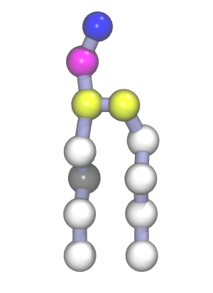
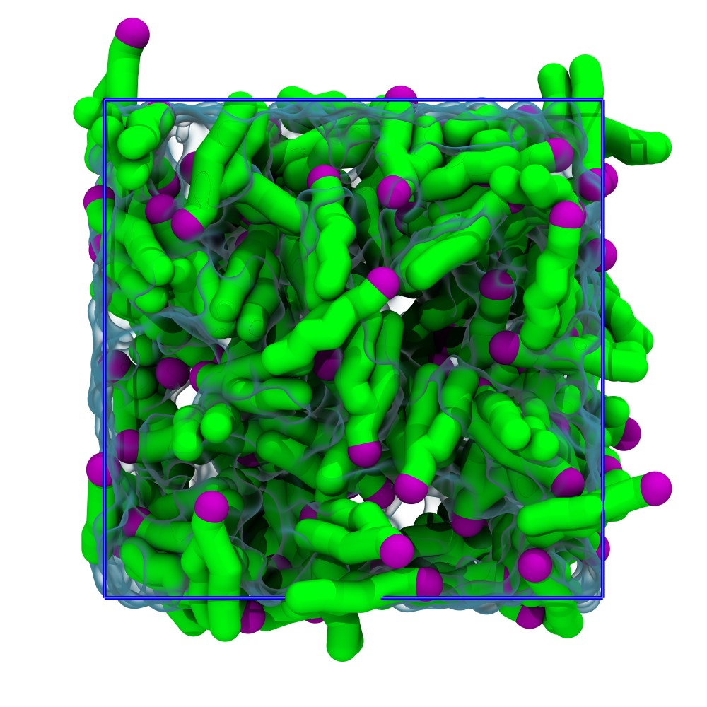
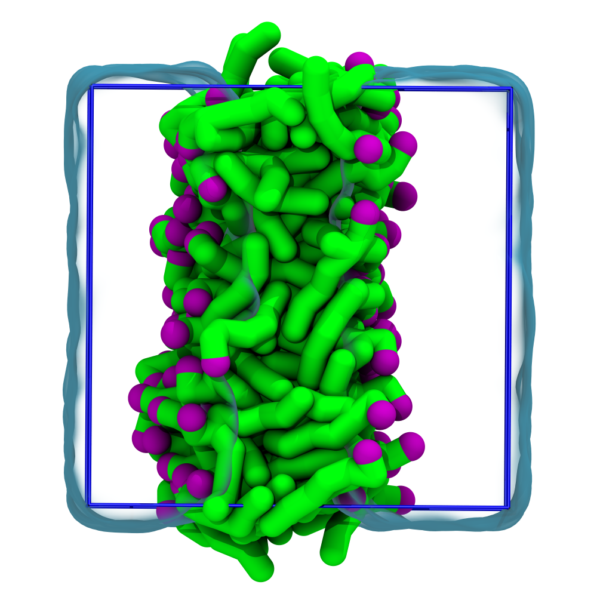

# Bilayer self-assembly

based on http://cgmartini.nl/index.php/2021-martini-online-workshop/tutorials/561-1-lipid-bilayers-i

The *Martini* coarse-grained (CG) model was initially developed for lipids[^marrink2004] [^marrink2007]. The underlying philosophy of *Martini* is to build an extendable CG model based on simple modular building blocks and to use only a few parameters and standard interaction potentials to maximize applicability and transferability. Martini 3 greatly expanded the number of possible interactions but retained this building-block approach[^souza2021]. Due to Martini's modularity, a large set of different lipid types has been parameterized. Their parameters are available with the [Martini 3 Release archive](../files/martini_v3.0.0). This tutorial will teach you how to set up lipid-water system simulations with lipids from this collection, focusing on bilayers.

The tutorial aims to create and study the properties of CG Martini models of lipid bilayer membranes. First, we will attempt to spontaneously self-assemble a lipid bilayer and check various properties that characterize lipid bilayers, such as the area per lipid, bilayer thickness, order parameters, and diffusion. Next, we will change the nature of the lipid head groups and tails and study how that influences the properties.

To start this tutorial, don't forget to navigate into the respective folder in the `martini-workshop` repository:

```sh
cd 01_bilayer_self_assembly
```

> [!TIP]
> You can download the worked examples of this tutorial [here](...). (GROMACS version 2024.1) 

### Programs

In this tutorial, we will use the following programs:

- `gmx` (`source .../GMXRC`).
- `xmgrace` or some other means of viewing `xvg` files.
- Common command line utilities.

## Preparing the starting structure



For this tutorial, we have chosen to use POPC (1-palmitoyl-2-oleoyl-sn-glycero-3-phosphocholine) as it is one of the more abundant lipids in the `JCVI-Syn3A` minimal cell. On the right a render of the Martini model for the POPC lipid is shown.

To self-assemble a lipid bilayer, we need to first generate a random configuration of lipids and water in the simulation box. The first step is to create a simulation box containing a random configuration of 128 POPC lipids. This can be done by starting from a file containing a single POPC molecule, which you can find in the current directory. Check this by running the command:

```sh
cat POPC.gro
```

The GROMACS tool `gmx insert-molecules` can take the `POPC.gro`, the single-molecule conformation, and attempt to place it in a simulation box multiple times at a random position and random orientation, each time checking that there are no overlaps between the consecutively placed molecules. Run the command:

```sh {execute}
gmx insert-molecules -ci POPC.gro -box 7.5 7.5 7.5 -nmol 128 -radius 0.21 -try 500 -o 128_POPC.gro
```
>[!TIP]
> For help on any GROMACS tool, you can add the -h flag.

The value of the flag -radius (default van der Waals radii) has to be increased from its default atomistic length (*0.105 nm*) to a value reflecting the size of Martini CG beads.

## Preparing the topology

To perform an MD simulation, we require both a starting structure and a topology. The topology defines all the interactions between the particles in the system, both bonded and non-bonded. These interactions, along with the positions of the particles, determine the forces acting on the system and ultimately its dynamics. Here, we will create the topology file ourselves by getting the topology for water and the POPC lipid and organizing them as a topology (`.top`) file.

You can find the Martini 3 forcefield parameters prepared in your current directory, inspect them by running:

```sh
ls -lH martini_v3.0.0
```
```text
martini_v3.0.0.itp
martini_v3.0.0_ions_v1.itp
martini_v3.0.0_nucleobases_v1.itp
martini_v3.0.0_phospholipids_v1.itp
martini_v3.0.0_proteins
martini_v3.0.0_small_molecules_v1.itp
martini_v3.0.0_solvents_v1.itp
martini_v3.0.0_sugars_v1.itp
```
Note that the Martini 3 release is organized into several `.itp` files, each with the definitions for a class of molecules. For this tutorial, you won’t need all of the Martini 3 .itps, only the one where water is defined (hint: it’s a ‘solvent’) and the one where POPC is defined (hint: it’s a ‘phospholipid’). There is a third .itp you will need, which is the one with all the Martini 3 particle definitions (hint: it’s `martini_v3.0.0.itp`). The needed .itps should be placed in the tutorial directory.

To generate the `.top` file that describes the system topology to GROMACS, you can use the template below. Note that semi-colons indicate comments, which are ignored, but hashtags aren’t: they’re preprocessing directives. Namely, it is the `#include` directive that allows us to bring into the .top the particle/molecule information in the `.itps`. 

Use your editor of choice (gedit/vi/other) to create a file `topol.top` and copy/paste the template below.

```sh
#include "martini_v3.0.0/martini_v3.0.0.itp" ; the particle definitions should be included first
#include "martini_v3.0.0/martini_v3.0.0_solvents_v1.itp" ; include here the relevant .itps defining the molecules to use
#include "martini_v3.0.0/martini_v3.0.0_phospholipids_v1.itp"

[ system ]
POPC BILAYER SELF-ASSEMBLY

[ molecules ]
; Molecule types and their numbers are written in the order
; they appear in the structure file
POPC 128
```

## Adding the water

We will use the Gromacs tool solvate to add the water beads to the simulation box. `gmx solvate` needs to have the structure of an equilibrated water box to use as a template to fill the empty space in our box of lipids (`128_POPC.gro`). An equilibrated water box structure file, `water.gro`, is provided in the `mdp_files` directory.

```sh {execute}
gmx solvate -cp 128_POPC.gro -cs mdp_files/water.gro -radius 0.21 -p topol.top -o 128_POPC_solvated.gro
```

Note that again, the value of the default van der Waals radii (`—radius`) has to be increased to reflect the size of Martini CG beads. We also provide the option `-p topol.top` to automatically include water beads inserted by GROMACS in our topology file. If you open the file ‘topol.top’, you see that at the bottom of the file, a line of the form “W …” is added.

<div align="center">

</div>

<center>
*__Figure 1 Starting structure__:  Snapshot of the system before the simulation.*
</center>

## A short energy minimization

Now that we have generated the initial structure for our simulation, we need to perform a brief energy minimization of the solvated system. This will help eliminate any high forces between beads that may have been placed too closely together. The settings file `em.mdp` is provided in the `mdp_files` directory. Feel free to inspect the settings file and afterward run the energy minimization:

```sh {execute}
mkdir -p em
gmx grompp -f mdp_files/em.mdp -c 128_POPC_solvated.gro -p topol.top -o em/em.tpr
gmx mdrun -v -s em/em.tpr -c em/em.gro
```

## Running the MD simulation

Now you are ready to run the self-assembly MD simulation using the `md.mdp` settings file and the energy-minimized structure. A short simulation of *50* ns, or *2.5* million simulation steps at *20* fs per step, should suffice to observe the self-assembly:

```sh {execute}
gmx grompp -f mdp_files/md.mdp -c minimized.gro -p topol.top -o md.tpr
gmx mdrun -v -s md.tpr -x md.xtc -c md.gro
```

This might take approximately *10* minutes on a single CPU but by default gmx mdrun will use all available CPUs on your machine. The `-v` option shows an estimate of the time to completion. See `gmx mdrun`’s help, `-h`, for instructions on how to tune the numbers of parallel threads used for the simulation. You may want to check the progress of the simulation to see whether the bilayer has already formed before the end of the simulation.

<div align="center">

</div>

<center>
*__Figure 2: Self-assembled lipid bilayer__ Snapshot of the simulation after a short MD simulation.*
</center>

## Visualization

You may want to check the progress of the simulation to see whether the bilayer has already formed before the end of the simulation. The easiest way to do this is to use [VMD](https://www.ks.uiuc.edu/Research/vmd/) (Visual Molecular Dynamics):

```sh 
vmd em/em.gro md/md.xtc -e ../files/viz.vmd
```

Here, we use the option `-e ../files/viz.vmd`, which loads in default representations for the Martini molecules in this workshop.

> [!WARNING]
> If you are already using a `.vmdrc` file, it might interfere with the visualizations in this tutorial. 

You will notice that the default visualization is not optimal. VMD suffers from the fact that Martini bonds are usually not drawn because they are much longer than the default atomistic bond lengths, which VMD expects. One way to circumvent this problem is by using a plugin script `cg_bonds-v5.tcl` that takes the GROMACS topology file and adds the Martini bonds defined in the topology. 

To use this plugin, we must first make our topology files understandable for *cg_bonds*. This workshop will use `viz_top_writer.py,` to automate the *cleaning* of the topology files. This tool is provided in the `../files` directory, but you normally want to download it from [here](https://github.com/csbrasnett/martini_vis). In the vmd console run:

```tcl
../files/vis_top_writer.py -p topol.top
```

If successful, a file named `vis.top` is created in your current directory with necessary adjustments. Now that we have our visualization topology, we can run *cg_bonds* inside the vmd terminal. The script is again provided in the `../files` directory, but you would normally want to download it from [here](http://cgmartini.nl/index.php/tools2/visualization). Now you can create the CG bonds in VMD by running:

```tcl
source ../files/cg_bonds-v5.tcl

cg_bonds -top vis.top
```
If all the steps went well, you're VMD window, should look similar to *Figure 2*.


## Bilayer equilibrium run and analysis

Before we continue, please check if your bilayer was formed in a plane other than the xy-plane, make sure to rotate the system so that it will. For this step you can use:
```sh
gmx editconf -f md/md.gro -rotate 90 0 0 -o md/md.gro
```

In case you did not get a bilayer at all, please extend your previous simulation or continue with the bilayer from the [worked examples](...).

The spontaneous assembly simulation was done using isotropic pressure coupling. The bilayer may have formed but is probably under tension because of the isotropic pressure coupling. Therefore, we first need to run a simulation in which the area of the bilayer can reach a proper equilibrium value. This requires that we use independent pressure coupling in the plane and perpendicular to the plane. Set up a simulation for another 50 ns at zero surface tension (we switch to semi-isotropic pressure coupling; if the pressure is the same in the plane and perpendicular to the plane, the bilayer will be at zero surface tension).

```sh {execute}
gmx grompp -f mdp_files/eq.mdp -c md/md.gro -p topol.top -o eq/eq.tpr
gmx mdrun -v -s eq.tpr -x eq.xtc -c md/md.gro
```

<details>
<summary> <strong> Good practices in membrane simulations </strong> </summary>


>To properly sample in an isothermal-isobaric ensemble, you should at this point switch to the Parrinello-Rahman barostat (12 ps is a typical tau-p value to use with it). The Parrinello-Rahman barostat is less robust than the Berendsen one, and may diverge (crash) if the system is far from equilibrium. As such, is usually used only on production runs, whereas Berendsen is used 
in preparation ones.

>Because of potentially poor heat transfer across the membrane-water interface, it is recommended that the solvent and the membrane groups of particles each be coupled to their own thermostat, to prevent unequal heat accumulation. You can set that in your .mdp using the tc-grps option.

>Buildup in numerical precision error may cause the system to gain overall momentum. This is undesirable because such translation will be interpreted as temperature by the thermostat, and result in an excessively cooled system. Such center-of mass motion (COMM) is corrected using comm-mode = linear. When membranes are involved, it is also possible (even in the absence of precision errors, or when controlling for COMM) that the membrane phase gains momentum relative to the water phase. In this case, the COMM should be corrected for each phase separately, using the comm-grps option. In some applications, it may be needed to further correct for the COMM of each leaflet separately.

</details>

### Bilayer thickness

As a first analysis we measure the overall bilayer thickness, using `gmx density`. You can get the density for a number of different functional groups in the lipid (e.g., phosphate and ammonium headgroup beads, carbon tail beads, etc) by feeding an appropriate index-file to `gmx density`. You can estimate the bilayer thickness from the distance between the headgroup peaks in the density profile.

```sh
gmx make_ndx -f eq/eq.gro

    > a P* [press Enter]

    > q [press Enter]
```


```sh
gmx density -f eq/eq.xtc -s eq/eq.tpr -b 15000 -n index.ndx -o p-density.xvg

    > 4 [press Enter]
```

Now you can open the `.xvg` file with Xmgrace:

```sh
xmgrace p-density.xvg 
```

A more appropriate way to compare to experimental measurements is to calculate the electron density profile. The gmx density tool also provides this option. However, you need to supply the program with a data file containing the number of electrons associated with each bead (option -ei electrons.dat). The format is described in the gromacs manual and not part of this tutorial.

Compare your results to those from small-angle neutron scattering experiments[4]:

- Thickness = *4.98 ± 0.15 nm*

- Area per lipid = *0.65 ± 0.05 nm^2*

### Lateral diffusion

To conclude calculate the lateral diffusion of the lipids in the membrane. Note that before calculating the lateral diffusion, you have to remove the jumps over the box boundaries with `gmx trjconv -pbc nojump`. Then, calculate the lateral diffusion using `gmx msd`. Take care to remove the overall center of mass motion (`-rmcomm`), and to fit the line only to the linear regime of the mean-square-displacement curve (`-beginfit` and `-endfit` options). To get the lateral diffusion, choose the `-lateral z` option.

```sh
gmx trjconv -f eq/eq.xtc -s eq/eq.tpr -pbc nojump -o eq/nojump.xtc

gmx msd -f eq/nojump.xtc -s eq/eq.tpr -rmcomm -lateral z -b 15000
```

Now you can open the `.xvg` file with Xmgrace:

```
xmgrace msd.xvg
```

In comparing the diffusion coefficient obtained from a Martini simulation to a measured one, one can expect a faster diffusion at the CG level due to the smoothened free energy landscape (note, however, that the use of a defined conversion factor is no longer recommended, as it can vary significantly depending on the molecule in question). Also note that the tool averages over all lipids to produce the MSD curve. It is probably much better to analyze the motion of each lipid individually and remove center-of-mass motion per leaflet.

## References
[^marrink2004]: Marrink, S. J., De Vries, A. H., and Mark, A. E. (2004) Coarse grained model for semiquantitative lipid simulations. J. Phys. Chem. B 108, 750–760. DOI:10.1021/jp036508g
[^marrink2007]: Marrink, S. J., Risselada, H. J., Yefimov, S., Tieleman, D. P., and De Vries, A. H. (2007) The MARTINI force field: coarse grained model for biomolecular simulations. J. Phys. Chem. B 111, 7812–7824. DOI:10.1021/jp071097f
[^souza2021]: Souza, P.C.T., Alessandri, R., Barnoud, J. et al. Martini 3: a general purpose force field for coarse-grained molecular dynamics. Nat Methods 18, 382–388 (2021). https://doi.org/10.1038/s41592-021-01098-3
