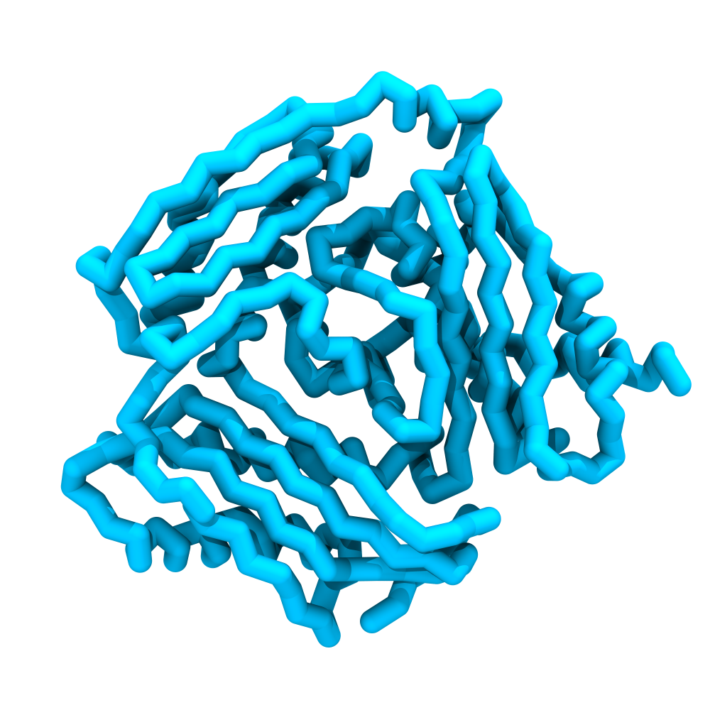
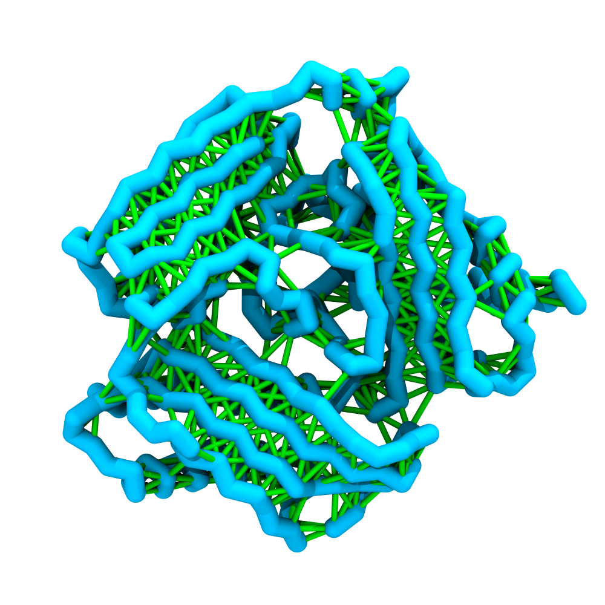
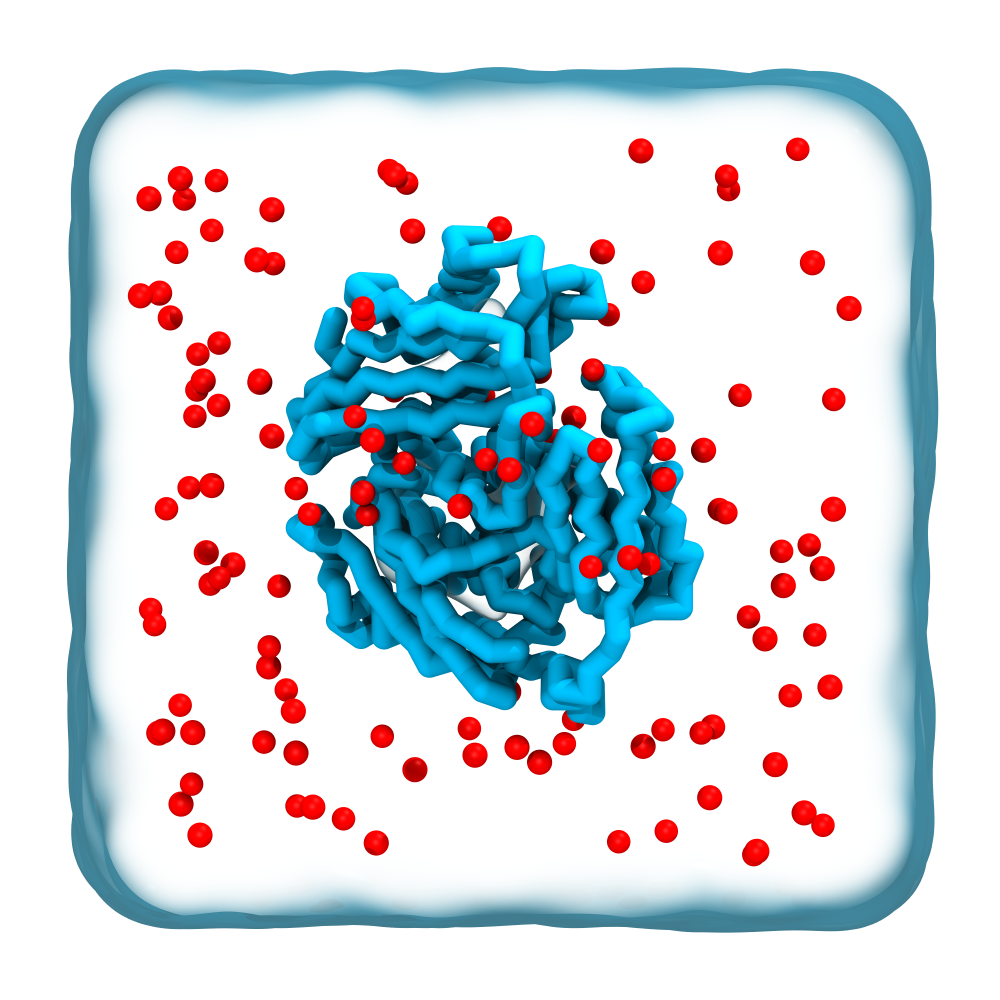

# Simulating a protein with Martini 3


In this tutorial, we will create and simulate a Martini 3 model based on an atomistic protein structure. The aim is to define the regular workflow and protocols for setting up coarse-grained simulations of soluble globular proteins.

We will create a CG model of a S-adenosylmethionine synthase protein selected from the *JCVI-syn3A* proteome.[^protein_uniprot] The all-atom structure was generated using an AlphaFold2.
 
To start this tutorial, don't forget to navigate to the respective folder in the `martini-workshop` repository:

```sh
cd 02_protein_basics
```

> [!TIP]
> You can download the worked examples of this tutorial [here](...). (GROMACS version 2024.1)  
 
### Programs

In this tutorial, we will use the following programs.

- `Martinize2` (`pip3 install vermouth`).
- `gmx` (`source .../GMXRC`).
- `xmgrace` or some other means of viewing `xvg` files.
- Common command line utilities.

## Obtaining the input structure

First, we download the structure file from the AlphaFold Protein Structure Database.
For clarity and readability in this tutorial, we store the file as `protein.pdb`.

```sh {execute}
wget https://alphafold.ebi.ac.uk/files/AF-P47293-F1-model_v4.pdb -O protein.pdb
```

Since we are using a structure from the AlphaFold database, we are already in very good shape to immediately move on to mapping the structure to a coarse-grain model.
Other models may require some clean-up prior to that step, however.
Generally, cleaning the structure comes down to removing any non-protein atoms, such as waters.

## Creating a CG model using _Martinize2_.

Now we are ready to map the atomistic structure to a coarse-grain model using _Martinize2_.[^Martinize2] This coarse-graining step is well-automated but requires quite a few input options. We use the following:

- `-f`: path to the input structure.
- `-o`: output path for the topology file
- `-x`: output path for the coarse-grained structure.
- `-p backbone`: instruct _Martinize2_ to apply position restrains to the backbone beads.
- `-ff martini3001`: the target force field is Martini 3.
- `-scfix`: apply side chain corrections.
- `-cys auto`: create cysteine bonds.
- `-elastic`: write elastic bonds.
- `-ef 700.0`: set the elastic bond force constant.
- `-el 0.5`: elastic bond lower cutoff.
- `-eu 0.9`: elastic bond upper cutoff.
- `-ea 0`: elastic bond decay factor a.
- `-ep 0`: elastic bond decay factor p.

```sh {execute}
martinize2 -f protein.pdb -o topol.top -x protein_cg.pdb \
    -p backbone -ff martini3001 -scfix -cys auto\
    -ef 700 -el 0.5 -eu 0.9 -ea 0 -ep 0
```


<details>
<summary>More details on the _Martinize2_ options.</summary>

>To help preserve the higher-order structure of proteins, we add extra harmonic bonds between non-bonded beads based on a distance cut-off. When the option `-elastic` is set, __Martinize2__ will automatically generate harmonic bonds between backbone beads, creating an *elastic network*.<br>
It is possible to tune the elastic bonds in order to make the protein behave properly: change the force constant (`-ef`), make the force constant distance-dependent (`-ea`, `-ep`), change upper and lower distance cut-off (`-eu`, `ea`). The only way to find the proper parameters is to try different options and compare the behavior of your protein to an atomistic simulation or experimental data (NMR, etc.).

>A second option which can complement improvements in structure and dynamics of side chains is the use of *side chain corrections* (`-scfix`), which are extra dihedrals added between side chains and backbone beads. 

>Be aware that both the *elastic networks* and the *side chain corrections* are based on your reference atomistic structure. A last aspect that can be considered is the addition of *disulfide bridges* that can also be automatically detected by Martinize2. 

</details>

Three outputs files will be generated: the coarse-grained structure file (`protein_cg.pdb`), the associated main topology file (`topol.top`), and a protein topology file (`molecule_0.itp`).
List the contents of your working directory with `ls` to see whether they have been created successfully.

<div id="image-table">
    <table>
	    <tr>
    	    <td style="padding:10px" align="center">
                
      	    </td>
    	    <td style="padding:10px" align="center">
                
            </td>
        </tr>
    </table>
</div>

*__Figure 1: Renders of the CG protein__ Left panel: Licorice representation of the Martini model of the S-adenosylmethionine synthase protein. Right panel: Both the protein backbone (in blue) and the elastic network (in green) are shown.*

Since _Martinize2_ creates a generically named `itp` file for us, we want to rename it to avoid confusion.
To match our naming strategy for this tutorial, we will rename the file to `protein.itp` and change the internal title as well.

```sh {execute}
mv molecule_0.itp protein.itp
```

With a text editor open `protein.itp`, and substitute the `[ moleculetype ]` from `molecule_0 1` to `protein 1`.

<details>
<summary>Is there a command for this?</summary>

We can also use something like a stream editor like `sed` to do this task.

```sh {execute}
sed -i 's/molecule_0/protein/' protein.itp
```
</details>

## Adjust the topology file

The file (`topol.top`) generated by _Martinize2_ contains a generic outline of a topology file for us; however, we have to make some adjustments to make it functional. In the topology file, we need to reference all `itp` files required for setting up simulations with the structures defined in it.


First of all, we changed the name of the `molecule_0.itp` file to `protein.itp`, so we also have to make that modification in the main topology file. Furthermore, we need to add the appropriate `#include`s for this force field at the top of `topol.top`.
These force field `itp`s can be found in the `martini_v3.0.0` directory.
If we list its contents, we see the following items:

```sh
ls -lH martini_v3.0.0
```

```
martini_v3.0.0_ions_v1.itp
martini_v3.0.0.itp
martini_v3.0.0_nucleobases_v1.itp
martini_v3.0.0_phospholipids_v1.itp
martini_v3.0.0_proteins
martini_v3.0.0_small_molecules_v1.itp
martini_v3.0.0_solvents_v1.itp
martini_v3.0.0_sugars_v1.itp
```

From these, we will need the base `martini_v3.0.0.itp` file as well as _ions_ and _solvents_ `itp`s, which will become relevant as we solvate our system in later steps.
You can add these with an editor you enjoy using, such that your `topol.top` is equivalent to our example below.
Notice that we set the title of the `[ system ]` to something appropriate, and that the `[ molecules ]` section features one instance of our renamed `protein`.

```conf
#include "martini_v3.0.0/martini_v3.0.0.itp"
#include "martini_v3.0.0/martini_v3.0.0_ions_v1.itp"
#include "martini_v3.0.0/martini_v3.0.0_solvents_v1.itp"
#include "protein.itp"

[ system ]
S-adenosylmethionine synthase

[ molecules ]
protein 1
```

<details>
<summary>Do it with a command!</summary>

```sh {execute}
cat > topol.top <<EOF
#include "martini_v3.0.0/martini_v3.0.0.itp"
#include "martini_v3.0.0/martini_v3.0.0_ions_v1.itp"
#include "martini_v3.0.0/martini_v3.0.0_solvents_v1.itp"
#include "protein.itp"

[ system ]
Peptide deformylase

[ molecules ]
protein 1
EOF
```

</details>

## Prepare our initial configuration

Now that we have made a first coarse-grained model of our protein, we will proceed through the standard MD protocol of minimization and equilibration before finally performing a short production simulation.

We want to specify a box large enough to fit our protein model without risking it interacting with itself over the periodic boundaries. We can use the GROMACS `gmx editconf` for this purpose:

- `-d 2.0`: set the minimum distance from the protein to any box side to 1.0 nm.
- `-bt cubic`: select the box type.

```sh {execute}
gmx editconf -f protein_cg.pdb -d 2.0 -bt cubic -o protein_cg.gro
```

The `gro` file produced in this step contains all beads defined in the cg `pdb` file that served as the input and also features the box vectors that were determined.
To inspect the box vectors, you can look at the last line in the `gro` file.

```sh
tail protein_cg.gro
```

## A short energy minimization

Before we add the solvent to the system, we will perform a short energy minimization (ca. 10-100 steps is enough!) in a vacuum. This initial short minimization is performed to resolve any high forces between beads that may have been mapped too closely together from the all-atom structure. Now do the preprocessing and minimization run:

```sh {execute}
mkdir -p em_vac
gmx grompp -f mdp_files/em.mdp -p topol.top -c protein_cg.gro -r protein_cg.gro -o em_vac/em_vac.tpr
gmx mdrun -v -deffnm em_vac/em_vac
```

## Solvate the structure

### Adding the solvent

We are ready to solvate the structure.
First, we will introduce water into the system using an equilibrated box of Martini 3 water (`mdp_files/water.gro`) as a reference. The solvated system is generated by overlaying the water structure on an input solute box (`em_vac/em_vac.gro`) and removing only the overlapping beads.

```sh {execute}
mkdir -p sol
gmx solvate -cp em_vac/em_vac.gro -cs mdp_files/water.gro -radius 0.21 -o sol/sol.gro -p topol.top
```

The default van der Waals radii has to be increased (`-radius 0.21`) from its default atomistic length (*0.105 nm*) to a value reflecting the size of Martini CG beads.<br>
Note that we also provide a topology file (`-p topol.top)` to keep track of the water beads inserted by GROMACS automatically. If you open the file ‘topol.top’, you see that at the bottom of the file, a line of the form “W …” is added.

### Adding ions

After adding this water, we will need to insert ions to neutralize the charge of our protein and bring the final salt concentration to 0.15 M NaCl.

While running `gmx genion`, you will be prompted to select a molecule group.
As you may expect, we want to place the ions in the `W` group.

```sh
gmx grompp -f mdp_files/ions.mdp -c sol/sol.gro -p topol.top -o sol/ions.tpr -maxwarn 1
gmx genion -s sol/ions.tpr -p topol.top -neutral -conc 0.15 -o sol/sol_neutral.gro
    > W [press Enter]
```

<details>
<summary>Can the group selection be automated?</summary>

Sure! You could also run the `gmx genion` command below with `echo W` before it.
For example:

```sh {execute}
gmx grompp -f mdp_files/ions.mdp -c sol/sol.gro -p topol.top -o sol/ions.tpr -maxwarn 1
echo W | gmx genion -s sol/ions.tpr -p topol.top -neutral -conc 0.15 -o sol/sol_neutral.gro
```

This works in many such instances.
Embrace ~~laziness~~ automation!
</details>


<details>
<summary>What is that warning about?</summary>

The system has a +2 net charge.
GROMACS warns that the results may not be valid since Ewald electrostatics are used, which can produce artifacts in non-neutral systems.
But we want to continue anyway since we intend to neutralize this net charge in this very step.
So, we can safely ignore the warning using the `-maxwarn 1` option.
</details>

<div align="center">

</div>
*__Figure 2: Render of our starting structure__ A Licorice representation of the protein model is shown in blue, surrounded by a transparent surface representing water beads. Red beads represent ions, NA and CL.*

## MD protocol

After setting up the simulation starting structure, we perform a short MD simulation. The standard Martini simulation protocol consists of three steps:

``` 
Energy minimization → Equilibration simulation → Production simulation.
```


### Energy minimization

The short minimization will help eliminate any high forces between beads that may have been placed too closely together during solvation. Now do the preprocessing and minimization run:

```sh {execute}
mkdir -p em
gmx grompp -f mdp_files/em.mdp -p topol.top -c sol/sol_neutral.gro -r sol/sol.gro -o em/em.tpr
gmx mdrun -v -deffnm em/em
```

### Equilibration Simulation

As the second step in our protocol, we need to perform a position-restrained (NPT) equilibration of the minimized system. _Martinize2_ has generated position restraints for the backbone beads (thanks to the `-p flag`). During the equilibration simulation, we'll use a relatively small timestep of *10fs*, a Berendsen thermostat, and position restraints (`define = -DPOSRES`).<br>
Now we can perform the preprocessing and equilibration:

```sh {execute}
mkdir -p eq
gmx grompp -f mdp_files/eq.mdp -p topol.top -c em/em.gro -r sol/sol.gro -o eq/eq.tpr -maxwarn 3
gmx mdrun -v -deffnm eq/eq
```

<details>
<summary>What are these warnings about?</summary>

You can expect to see three warnings regarding the use of a Berendsen thermostat and barostat, as well as a warning about pressure coupling with absolute position restraints.
We can ignore these, since the artifacts that we are warned about are not of concern to us in this phase.
In this step, we want to equilibrate the system rapidly _before_ we move on to the actual, proper molecular dynamics run.
In that final run, we will use an `mdp` recipe that addresses these concerns by selecting a more appropriate thermostat and barostat.
The warning about pressure coupling with absolute position restraints will not be relevant anymore, since we let go of those restraints by then.
</details>

### Running production simulation

Finally, we are ready to run a production molecular dynamics simulation.
The setup will be straightforward, and the execution will be quite familiar now.

But first, let's look at the `.mdp` options.

```sh {execute}
less mdp_files/md.mdp
```

You can read that we will run the simulation for *2500000* steps, with a *20 fs* time step.
From this, we can quickly calculate that the simulation will sample *2500000 &sdot; 20 fs = 5&times;10<sup>7</sup> fs = 50 ns*.

<details>
<summary>Details on the `.mdp` options:</summary>

>The number of steps per compressed frame output (`nstxout-compressed`) is set to 50000, so we will store 50 frames. 
>The temperature coupling is set to a velocity-rescaling protocol, and a Parrinello-Rahman barostat is used.
>Since the system can be considered to be symmetrical across all axes, an isotropic pressure coupling is the appropriate choice here.
>The constraints are set to `none`, since we are interested in the unconstrained dynamics, here.

</details>

Now do the preprocessing and run the production simulation:

```sh {execute}
mkdir -p md
gmx grompp -f mdp_files/md.mdp -p topol.top -c eq/eq.gro -o md/md.tpr
gmx mdrun -v -deffnm md/md
```

## Visualization

The easiest way to visualise this trajectory is to use [VMD](https://www.ks.uiuc.edu/Research/vmd/) (Visual Molecular Dynamics). However, during the simulation, your protein might have crossed the PBC, which will cause artifacts while in the visualization. We can resolve this by postprocessing our trajectory using `gmx trjconv` by:

- `-pbc whole`: make molecules that are broken up by the pbc whole.
- `-center`: place the molecules in the center of the box.
 
```sh {execute}
gmx trjconv -s md/md.tpr -f md/md.xtc -o md/traj.xtc -pbc whole -center
    > Protein [press Enter]

    > System [press Enter]
```

This should have fixed our trajectory for visualisation, which we can now open in VMD:

```sh 
vmd eq/eq.gro md/traj.xtc -e ../files/viz.vmd
```

Here, we use the option `-e ../files/viz.vmd`, which loads in default representations for the Martini molecules in this workshop.

> [!WARNING]
> If you are already using a `.vmdrc` file, it might interfere with the visualizations in this tutorial. 

You will notice that the default visualization is not optimal. VMD suffers from the fact that Martini bonds are usually not drawn because they are much longer than the default atomistic bond lengths, which VMD expects. One way to circumvent this problem is by using a plugin script `cg_bonds-v5.tcl` that takes the GROMACS topology file and adds the Martini bonds defined in the topology. 

To use this plugin, we must first make our topology files understandable for *cg_bonds*. This workshop will use `viz_top_writer.py,` to automate the *cleaning* of the topology files. This tool is provided in the `../files` directory, but you normally want to download it from [here](https://github.com/csbrasnett/martini_vis). In the vmd console run:

```tcl
../files/vis_top_writer.py -p topol.top
```

If successful, a file named `vis.top` is created in your current directory with necessary adjustments. Now that we have our visualization topology, we can run *cg_bonds* inside the vmd terminal. The script is again provided in the `../files` directory, but you would normally want to download it from [here](http://cgmartini.nl/index.php/tools2/visualization). Now you can create the CG bonds in VMD by running:

```tcl
source ../files/cg_bonds-v5.tcl

cg_bonds -top vis.top
```
If all the steps went well, you're VMD window, should look similar to *Figure 2*.


## Analysis

Now, you've got a simulation of a Martini protein with different Martini protein models. If you do not want to wait, pre-run trajectories can be found in the archive.

An easy way to evaluate the behaviors of the Martini proteins in our simulation is to follow the deviation/fluctuation of the backbone during the simulation (and compare it to an all-atom simulation if possible). We will calculate the protein model's root mean square deviation (RMSD) and root mean square fluctuation (RMSF) using GROMACS.

For clarity, we create an analysis directory to write our output files into.

```sh {execute}
mkdir -p analysis
```

### RMSD
To calculate the RMSD, we use the GROMACS tool `gmx rms`:

```sh {execute}
gmx rms -s md/md.tpr -f md/traj.xtc -o analysis/rmsd.xvg

    > Protein [press Enter]

    > Protein [press Enter]
```

### RMSF
To calculate the RMSF, we use the GROMACS tool `gmx rmsf`:

```sh {execute}
gmx rmsf -s md/md.tpr -f md/traj.xtc -o analysis/rmsf.xvg

    > Protein [press Enter]
```

>[!TIP]
> Redo the tutorial while changing the input parameters provided to _Martinize2_ to generate the elastic network and see how this affects the RMSD and RMSF. Logically, removing the elastic network will result in both these values being much higher.

[^protein_uniprot]: https://www.uniprot.org/uniprotkb/P47293/entry
[^Martinize2]: Kroon P C, Grunewald F, Barnoud J, van Tilburg M, Souza P C T, Wassenaar T A, Marrink S J (2023) Martinize2 and Vermouth: Unified Framework for Topology Generation eLife 12:RP90627 https://doi.org/10.7554/eLife.90627.1
