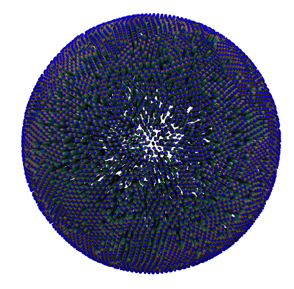

# Simulating Membranes and Vesicles with TS2CG

## Introduction

**TS2CG** is used to build coarse-grained (CG) membrane models with user-defined shapes and
compositions. Initially, it was developed for backmapping dynamically triangulated simulation
structures into their corresponding molecular models. This gives us the possibility to incorporate
experimentally obtained membrane shapes and compositions and generate CG membrane's initial structure.

In *Figure 1* the general workflow of **TS2CG** is exemplified for a vesicle containing a single protein
(shown as a yellow bead). The initial triangulated surface is rescaled to the desired system size
and the two monolayers are generated. In order to have enough points for the subsequent lipid
placement, the number of vertices in both monolayers is increased using a *pointillism* operation,
i.e. each triangle is divided into four new triangles thereby increasing the number of vertices by
a factor of four. In the last steps, proteins and lipids are placed on the respective vertices. For
more details on the method, please refer to the original paper [^TS2CG]


*__Figure 1:__ Steps in backmapping a triangulated surface (TS) mesh using **TS2CG**. Steps in
backmapping a triangulated surface (TS) mesh using **TS2CG**. (Step 1) A TS structure of a vesicle
containing one protein (yellow bead) is rescaled and two TS structures corresponding to the two
monolayers that are generated. (Step 2) Using a Pointillism operation, the number of vertices is
increased. (Step 3) The CG protein structure together with a membrane segment is placed at the
appropriate TS position. (Step 4) Lipids are placed at the remaining positions and the
configuration is ready for subsequent MD simulation. [^TS2CG]*

<div id="image-table">
    <table>
	    <tr>
    	    <td style="padding:10px">
                
      	    </td>
    	    <td style="padding:10px" align="center">
                
            </td>
        </tr>
    </table>
</div>


*__Figure 2: Example applications of TS2CG__ Example applications of **TS2CG**. Mitochodrion lipid
membrane backmapped from EM map (upper panel left), protein induced membrane tubulation backmapped
from DTS simulation (upper panel right), budded lipid bilayer including STxB proteins backmapped
from DTS simulation (lower panel left) and curved lipid bilayer with two different lipid types
created from scratch using PCG. [^TS2CG]*


## Download and install TS2CG

Download the latest version of the **TS2CG** from

```{execute}
git clone https://github.com/marrink-lab/TS2CG1.1/tree/master
cd TS2CG1.1
```

For compiling, *gcc* version 8.3.0 or above is needed.

In the source code folder, execute the script `compile.sh` as

```{execute}
./compile.sh
```

In this folder, two binary files will be generated: `Pointillism (PLM)` and `CG Membrane Builder (PCG)`.


## Simple flat membrane

First step in this tutorial is using a simple TS file of a sphere to create a vesicle. From the files
folder select the `Sphere.tsi` file. Use a text editor to open this and familiarize yourself
with the structure. See `.tsi` file format at the end of this document for more information about the file format.

The first step in backmapping any TS file to a CG structure is to increase the number of vertices
using a pointillism operation. In the same step we also generate the two monolayers. Do this by
executing the following command:

- `-TSfile`: TS file name (default=TS.tsi)
- `-bilayerThickness`: bilayer thickness (default=3.8)
- `-rescalefactor`: rescaling factor rx ry rz (default = 1 1 1)
```{execute}
PLM -TSfile sphere.tsi -bilayerThickness 3.8 -rescalefactor 4 4 4
```

If the command completes succesfuly two directories have been created in the current working directory.
In the pointvisualization_data folder, you will find gromacs compatible structure files
(.gro) for the upper and lower monolayer including a topology file (.top).
You can have inspect the created points using vmd. The other folder is named point and will be used by the CG Membrane Builder to create the CG model.
This folder contains files which store a higher level detailed information of the pointelised mesh (coordinates/normals/curvature).

The second step to create a vesicle is two place lipids on the generated points using PCG. For this
you need to write a .str file defining the lipid composition of both monolayers.
Using any text editor, create an `input.str` file and write the following text in it:

```{execute}
[Lipids List]
Domain      0
POPC     1     1     0.64
End
```

This implies that your system should contain only one lipid domain with POPC in both monolayers
using an area per lipid (APL) for POPC of 0.64. To know more about the .str file format and other
options see the User Manual[^UserManual].

The other thing we need is a lipid structure file (.LIB). This file simply defines the lipid
connectivity for placing the lipid beads on the previously generated points. Making this file is
easy but might be time consuming for many different lipids. (See the User Manual for the exact file
format). Luckily, we already have a file that contains all Martini3 lipids called Martini3.LIB,
you can find it in the files folder.

Using these two files now you can execute PCG:

- `-str`: input file (default = input.str)
- `-function`: backmap/analytical_shape (default=backmap)
- `-LLIB`: CG lipid library file name (default=no)
- `defout`: output files prefix (default = output)

```{execute}
PCG -str mixture.str -Bondlength 0.2 -LLIB Martini3.LIB
```
Two files, output.gro and output.top, should have been generated.

<table>
<td>
    <div align="center">
    
    </div>
</td>
<td>

```text
[ Shape Data ]
ShapeType 1D_PBC_Fourier
Box 20 10 20
WallRange 0 1 0 1
Density 3 1
Thickness 4
Mode 1.5 1 0
Mode 0.5 2 0
End
```

</td>
</table>

*__Figure 3__: Snapshot of the simple POPC membrane we created.*

<details>
<summary> You can also use <b>analytical shapes</b> to generate simple membrane shapes. </summary>

### Fixed shapes

To use an fixed shape instead of a TS file, we have to use the analytical shape option of **PCG**
and we need to specify which shape we want in the input.str file.

```{execute}
PCG -str input.str -function analytical_shape -LLIB Martini3.LIB
```

You can do this by adding `[ Shape Data ]` section to the 'input.str' file. In this section
you can specify the analytical shape you want the membrane to be (sphere, cylinder, 1D fourier,
flat) and some shape properties relevant for the chosen shape (size, density, ...). Below are four
examples of for all the available shapes.

<table>
<tr>
<td>
<div align="center">
<b>Sphere</b><br>
</div>


```text
[ Shape Data ]
ShapeType Sphere
Box 40 40 40
Density 2
WallDensity 1 1
Thickness 4
DL 0.2
Radius 15
End
```

</td>
<td>
<div align="center">
<b>1D Fourier Shape</b><br>
</div>

```text
[ Shape Data ]
ShapeType 1D_PBC_Fourier
Box 20 10 20
WallRange 0 1 0 1
Density 3 1
Thickness 4
Mode 1.5 1 0
Mode 0.5 2 0
End
```

</td>
</tr>
<tr>
</tr>
<tr>
<td>
<div align="center">
<b>Cylinder</b><br>
</div>

```text
[ Shape Data ]
ShapeType Cylinder
Box 40 40 40
Density 2
Thickness 4
Radius 12
End
```

</td>
<td>
<div align="center">
<b>Flat</b><br>
</div>

```text
[ Shape Data ]
ShapeType Flat
Box 40 40 40
Density 2 2
Thickness 4
WallRange 0 1 0 1
End
```

</td>
</tr>
</table>

</details>

## Creating lipid mixtures

The second step to create a vesicle is two place lipids on the generated points using PCG. For this
you need to write a .str file defining the lipid composition of both monolayers.
Using any text editor, create an `input.str` file and write the following text in it:

```text
[Lipids List]
Domain      0
POPC      0.5     0.5     0.64
DOPC      0.5     0.5     0.67
End
```

Executing **PCG** will generate two output files output.gro and output.top:

```{execute}
PCG -str mixture.str -Bondlength 0.2 -LLIB Martini3.LIB
```

<table>
<td>
    <div align="center">
    
    </div>
</td>
<td>

```text
[ Shape Data ]
ShapeType 1D_PBC_Fourier
Box 20 10 20
WallRange 0 1 0 1
Density 3 1
Thickness 4
Mode 1.5 1 0
Mode 0.5 2 0
End
```

</td>
</table>
*__Figure 4__: Snapshot of the mixed POPC (blue) / DOPC (orange) bilayer made with VMD (left) and the corresponding topology file (right).*


## Adding proteins to a membrane

### Creating model

pdb file given

```{execute}
memembed -o memembed.pdb potassium_transporter.pdb
```

Visually inspect the generated file `memembed.pdb` and confirm that the orientation of the protein
in the membrane makes sense.

```{execute}
sed '/DUM/d' memembed.pdb >> PT_oriented.pdb
```

```{execute}
martinize2 -f  PT_oriented.pdb -x PT_cg.pdb -p backbone -ff martini3001 -elastic -scfix -cys auto -ef 700.0 -el 0.5 -eu 0.9 -ea 0 -ep 0

gmx editconf -f PT_cg.pdb -o PT_cg.gro
```

### TS2CG settings

To start we have to point **TS2CG** to the protein structure we want to include in our membrane.
Similar to the topology files in **GROMACS** this is done by adding an `include` statement at the
top of the `input.str` file.

```
include PT_cg.gro
```

The next step is to define the proteins in the `input.str` file. In addition to including the
protein `.gro` file names in the header, there should be some information about the protein placement:

```
[ Protein List ]
 potassium_transporter     1     0.01     0     0     -3.7
End Protein
```

> [!CAUTION]
> Make sure that the name you use in the `[ Protein List ]` directive is also the name first line
> of the protein's `.gro` file. This is not the case yes, change this.

As a last step we have to modify the 'sphere.tsi' file to include the protein at a chosen vertex
input. Opening the Upper.gro or Lower.gro file in VMD enables you to inspect the mesh and choose an
appropriate postitoin for the proteins, here we choose positions:

```
inclusion      2
0     1     10     0     1
1     1     100    0     1
```


<table>
<td>
    <div align="center">
    
    </div>
</td>
<td>

```text
[ Shape Data ]
ShapeType 1D_PBC_Fourier
Box 20 10 20
WallRange 0 1 0 1
Density 3 1
Thickness 4
Mode 1.5 1 0
Mode 0.5 2 0
End
```

</td>
</table>

*__Figure 5__: Snapshot of the membrane protein in a bilayer made with VMD (left) and the corresponding topology file (right).*

### Simulation

## Inserting a protein in the membrane

write input.str file
```{execute}
include potassium_transporter_cg.gro

[Lipids List]
Domain 0
POPC 0.50 0.50 0.594
DOPG 0.50 0.50 0.583
End

[Protein List]
potassium_transporter   1   0.01    0   0   0
End Protein
```

Add inclusions
```{execute}
inclusion   1
    0   1   10   0.00    1.00
```


```{execute}
PLM -TSfile Sphere.tsi -Mashno 3 -bilayerThickness 3.8 -rescalefactor 4 4 4
```

```{execute}
PCG -str input.str -Bondlength 0.2 LLIB Martini3.LIB
```


## Visualise


### .TSI file

The following shows a part of a .tsi file with all necessary keywords highlighted in bold. Every .tsi file starts with a line calling version 1.1 of TS2CG. The next line defines the box size (x, y, and z) of the system in nm. The next three sections describe the TS mesh. Each section starts with a keyword (vertex, triangle and inclusion) and their corresponding number. Here, we have 130 vertices (the numbering starts from 0). Each vertex has an index and a position in x, y and z (in nm). Additionally, a vertex can have a domain id, e.g., vertices 1, 126 and 127 belong to domain 1. The default domain is 0. The 130 vertices are connected via 256 triangles. Again, every triangle has an index (starting from 0) and is defined by the vertices the triangle connects, i.e. triangle 0 connects vertices 11, 55 and 43. Furthermore, a .tsi file can have a (protein) inclusion section. Here, there are three inclusions from two different types. Again, each inclusion has an index. The index is followed by the inclusion type (here: type 1 for inclusions 0 and 1, type 2 for inclusion 2) and the corresponding vertex index. The last two (floating point) numbers describe a unit two dimensional vector (sum of both numbers must be one!) which defines the orientation of the inclusion with respect to the bilayer normal.

```

version 1.1
box   50.0000000000     50.0000000000     50.0000000000
vertex         130
0     21.1606233083     25.4394806652     25.5960855271
1     27.0284995400     23.2012757654     21.6715285158     1
2     26.9921761232     25.5136587223     28.0195776981
3     23.3273229896     26.2315165676     28.0075875808     2
4     26.2722773116     26.3271061222     28.1420707299
5     22.0396876425     23.6080597437     26.8858740866     2
.
.
.
125   21.5556280860     25.5595098219     26.5363425272
126   23.2182025326     26.8060871266     21.5195141902     1
127   25.3199303865     24.3519379911     20.6752314764     1
128   28.0093200458     22.6356946990     23.4685318698
129   21.4000741257     26.5841316766     25.2761757772
triangle       256
0     11     55     43
1     94     75     14
2     64      3     91
3     59     52     40
.
.
.
253   33    109     44
254   53     69     47
255   85      6     74
inclusion        3
0      1     22      0     1
1      1      5      0     1
2      2     30      0     1


```

## References
[^TS2CG]: Pezeshkian, W., König, M., Wassenaar, T.A. et al. Backmapping triangulated surfaces to coarse-grained membrane models. Nat Commun 11, 2296 (2020). https://doi.org/10.1038/s41467-020-16094-y
[^UserManual]: https://github.com/marrink-lab/TS2CG1.1/blob/master/User_Manual.docx
