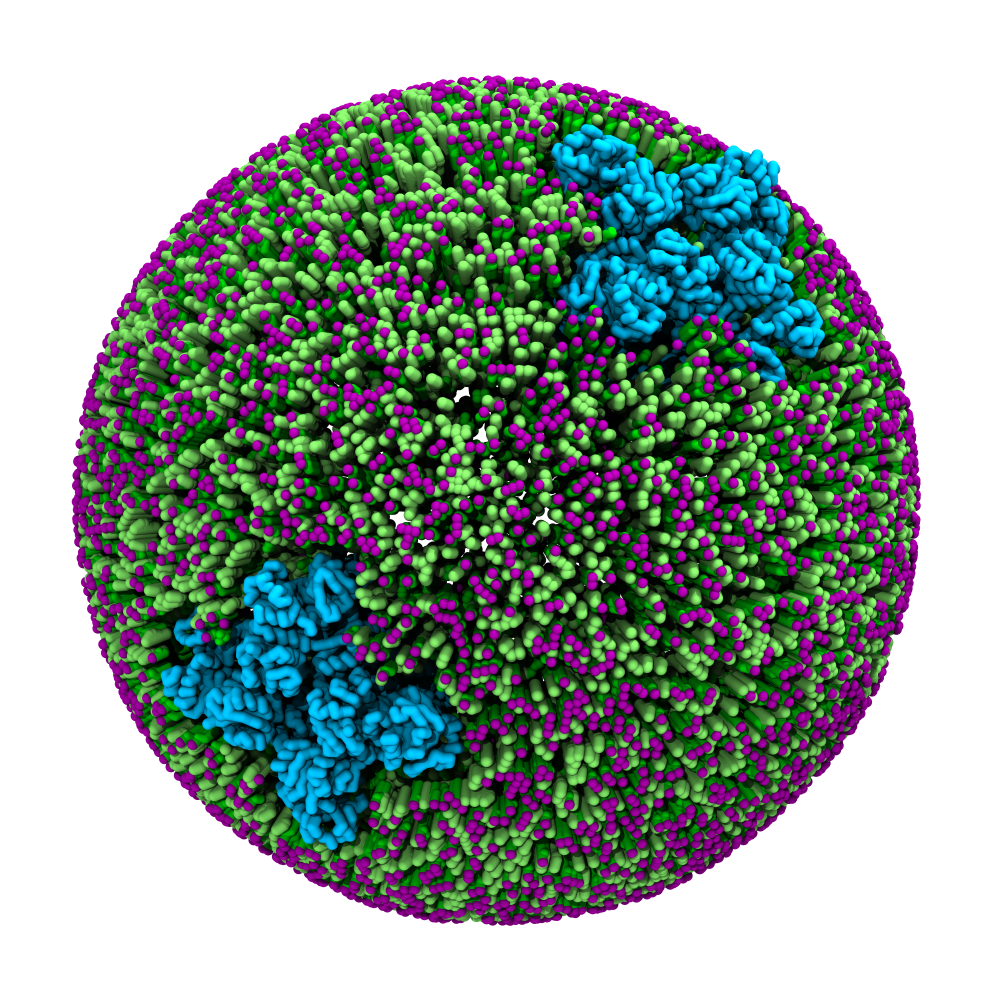

# Simulating Membranes and Vesicles with TS2CG
An integral component of a cell is its envelope, a membrane made up of a mixture of lipids and proteins that separates the cytosol (proteins, metabolites, etc.) from the extracellular space. In this tutorial, we will discuss how to use _TS2CG_ to construct these large lipid membranes.

To start this tutorial, don't forget to navigate to the respective folder in the `martini-workshop` repository:

```sh
cd 02_protein_basics
```

> [!TIP]
> You can download the worked examples of this tutorial [here](...). (GROMACS version 2024.1)  
 
### Programs

In this tutorial, we will use the following programs.

- `TS2CG`.
- `gmx` (`source .../GMXRC`).
- Common command line utilities.

To install TS2CG, download the latest version of the _TS2CG_ from

```{execute}
git clone https://github.com/marrink-lab/TS2CG1.1
cd TS2CG1.1
```

For compiling, *gcc* version 8.3.0 or above is needed.

In the source code folder, execute the script `compile.sh` as

```{execute}
./compile.sh
```

In this folder, two binary files will be generated: Pointillism (`PLM`) and CG Membrane Builder (`PCG`).

## Introduction

_TS2CG_ is a tool which can be used to build coarse-grained (CG) membrane models with user-defined shapes and compositions. Initially, it was developed for backmapping dynamically triangulated simulation
structures into their corresponding molecular models. This gives us the possibility to incorporate
experimentally obtained membrane shapes and compositions and generate CG membrane's initial structure.

In *Figure 1* the general workflow of _TS2CG_ is exemplified for a vesicle containing a single protein
(shown as a yellow bead). The initial triangulated surface is rescaled to the desired system size
and the two monolayers are generated. In order to have enough points for the subsequent lipid
placement, the number of vertices in both monolayers is increased using a *pointillism* operation,
i.e. each triangle is divided into four new triangles thereby increasing the number of vertices by
a factor of four. In the last steps, proteins and lipids are placed on the respective vertices. For
more details on the method, please refer to the original paper [^TS2CG]


*__Figure 1: Overview of the _TS2CG_ workflow:__ Steps in backmapping a triangulated surface (TS) mesh
using _TS2CG_. Steps in backmapping a triangulated surface (TS) mesh using _TS2CG_. (Step 1) A
TS structure of a vesicle containing one protein (yellow bead) is rescaled and two TS structures
corresponding to the two monolayers that are generated. (Step 2) Using a Pointillism operation, the
number of vertices is increased. (Step 3) The CG protein structure together with a membrane segment
is placed at the appropriate TS position. (Step 4) Lipids are placed at the remaining positions and
the configuration is ready for subsequent MD simulation. [^TS2CG]*

<div id="image-table">
    <table>
	    <tr>
    	    <td style="padding:10px">
                
      	    </td>
    	    <td style="padding:10px" align="center">
                
            </td>
        </tr>
    </table>
</div>

__Figure 2: Example applications of TS2CG__ Example applications of _TS2CG_. Mitochodrion lipid
membrane backmapped from EM map (upper panel left), protein induced membrane tubulation backmapped
from DTS simulation (upper panel right), budded lipid bilayer including STxB proteins backmapped
from DTS simulation (lower panel left) and curved lipid bilayer with two different lipid types
created from scratch using **PCG**. [^TS2CG]

## Building a vesicle

The first step in this tutorial is using a TS file of a sphere to create a vesicle. In this tutorial's
directory you can find the corresponding `sphere.tsi` file. Use a text editor to open this and familiarize yourself
with the structure. For more information on the `.tsi` file format, see [the section](#tsi-file-format)
at the end of this document.

The initial step in backmapping any TS file to a CG structure involves increasing the number of
vertices to ensure we have a vertex for every lipid we intend to place. This is achieved through a
operation we call `pointillism`. Simultaneously, we can rescale the mesh to a desired size and
generate the two separate meshes of our bilayer. To perform this `pointilism` operation, by
executing the following command:

- `-TSfile`: TS file name (default=TS.tsi)
- `-bilayerThickness`: bilayer thickness (default=3.8)
- `-rescalefactor`: rescaling factor rx ry rz (default = 1 1 1)
- `-Mashno`: number of Mosaicing steps, your vertex number increases by 4^Mashno (default = 0)
 
```{execute}
PLM -TSfile sphere.tsi -bilayerThickness 3.8 -rescalefactor 4 4 4 -Mashno 4
```

The initial `sphere.tsi` is only `4 nm` in radius, for our purpose we rescale it by a factor 5 in all direction. Since
the overall mesh becomes larger we also have to increase the number of point, here we subsample each triangle twice (`-Mashno 4`), increasing the number of vertices by a factor of `4^2`. For a cell of 400nm in radius we would need a rescale the mesh a hundred times in all three dimensions (-rescalefactor 100 100 100) and use increase the number a thousand fold (-mashno 6).

If the command completes successfully two directories have been created in the current working directory.
In the pointvisualization_data folder, you will find gromacs compatible structure files
(`.gro`) for the upper and lower monolayer including a topology file (`.top`).
You can have inspect the created points using VMD. The other folder is named `point` and will be used
by the CG Membrane Builder to create the CG model. This folder contains files that store detailed information about the pointillized mesh, including coordinates, normals, and curvature.

The second step to create a vesicle is to place lipids on the generated points using **PCG**. For this
you need to write a `.str` file defining the lipid composition of both monolayers.
Using any text editor, create an `input.str` file and write the following text in it:

```{execute}
[Lipids List]
Domain      0
POPC    1.00    1.00    0.54
End
```

This implies that your system should contain only one lipid domain with POPC in both monolayers
using an area per lipid (APL) for POPC of 0.64. To know more about the `.str` file format and other
options see the User Manual[^UserManual].

The other thing we need is a lipid structure file (`.LIB`). This file simply defines the lipid
connectivity for placing the lipid beads on the previously generated points. Making this file is
easy but might be time consuming for many different lipids. (See the User Manual for the exact file
format). Luckily, we already have a file that contains all Martini3 lipids called `Martini3.LIB`,
which you can find in the files folder.

Using these two files now, you can execute **PCG**:

- `-str`: input file (default: `input.str`)
- `-function`: backmap/analytical_shape (default: backmap)
- `-Bondlength`: initial bond guess for lipids
- `-LLIB`: CG lipid library file name (default: no)
- `defout`: output files prefix (default: output)

```{execute}
PCG -str input.str -function backmap -Bondlength 0.2 -LLIB Martini3.LIB -defout output
```
Executing **PCG** will have generate two output files `output.gro` and `output.top` and the
output should look like *Figure 3*.

<table>
<td>
    <div align="center">
    
    </div>
</td>
<td>

```text

; This file was generated by TS2CG
 [ system ]
 Expect a large membrane
 [ molecules ]
; domain 0
 ;  in the upper monolayer
     POPC  7417
; domain 0
 ;  in the lower monolayer
     POPC  4595
     
```

</td>
</table>

*__Figure 3__: Left panel: Snapshot of the simple POPC membrane we created. Right panel: The topology file corresponding to the build system.*

> [!TIP]
> For simple membrane geometries you can also use an <b>analytical shape</b> as input to generate a
> bilayer geometry instead of a `TS file`.

<details>
<summary> <strong>Details:</strong> How to use analytical shapes in <strong>TS2CG</strong>:</summary>

## Fixed shapes

If you are making a membrane with a simple shape, creating TS file (i.e. mesh) can be a cumbersome
intermediate step.
In these cases it is often easier to use an analytical shape definition instead of the TS file.
This functionality is also supported in _TS2CG_ by means of the `analytical_shape` option of **PCG**.

The analytical shape is specified by adding `[ Shape Data ]` section to the `input.str` file. In
this section you can specify the type of analytical shape (sphere, cylinder, 1D fourier, flat) and
relevant properties of the chosen shape (size, density, ...). Below are four examples of for all
the available shapes.

<table>
<tr>
<td>
<div align="center">
<b>Sphere</b><br>
</div>


```text
[ Shape Data ]
ShapeType Sphere
Box 40 40 40
Density 2
WallDensity 1 1
Thickness 4
DL 0.2
Radius 15
End
```

</td>
<td>
<div align="center">
<b>1D Fourier Shape</b><br>
</div>

```text
[ Shape Data ]
ShapeType 1D_PBC_Fourier
Box 20 10 20
WallRange 0 1 0 1
Density 3 1
Thickness 4
Mode 1.5 1 0
Mode 0.5 2 0
End
```

</td>
</tr>
<tr>
</tr>
<tr>
<td>
<div align="center">
<b>Cylinder</b><br>
</div>

```text
[ Shape Data ]
ShapeType Cylinder
Box 40 40 40
Density 2
Thickness 4
Radius 12
End
```

</td>
<td>
<div align="center">
<b>Flat</b><br>
</div>

```text
[ Shape Data ]
ShapeType Flat
Box 40 40 40
Density 2 2
Thickness 4
WallRange 0 1 0 1
End
```

</td>
</tr>
</table>

Simply adding one of these `[ Shape Data ]` sections to the input file, enables
you to create the lipid membrane in only one command. Try this by modifying the `input.str` and run
the following command:

```{execute}
PCG -str input.str -function analytical_shape -Bondlength 0.2 -LLIB Martini3.LIB -defout output
```

</details>


## Creating lipid mixtures


Realistic cell membranes are not composed of single lipid type, but usually comprise of a complex
mixtures of lipids with a large variety in headgroups and tails. In this second part of the tutorial
we will create a vesicle containing a mixture of two lipids that will be randomly placed on the
generated points using **PCG**.

For this you need to edit the `.str` input file defining the lipid composition of both monolayers.
Using any text editor, edit the `input.str` file and write the following text in it:

```text
[Lipids List]
Domain      0
POPC    0.50    0.50    0.54
CHOL    0.50    0.50    0.32
End
```


```{execute}
PCG -str input.str -function backmap -Bondlength 0.2 -LLIB Martini3.LIB -defout output
```

Executing **PCG** again will have generate two output files `output.gro` and `output.top` and the
output should look like *Figure 4*.

<table>
<td>
    <div align="center">
    
    </div>
</td>
<td>

```text

 ;This file was generated by TS2CG.
 [ system ]
 Expect a large membrane
 [ molecules ]
; dom
 ;  in the upper monolayer
     POPC  4657
     CHOL  4657
; domain 0
 ;  in the lower monolayer
     POPC  2885
     CHOL  2885
     
```

</td>
</table>

*__Figure 4__: Left panel: Snapshot of the mixed POPC (green /purple) / CHOL (light green) bilayer. Right panel: The topology file corresponding to the build system.*

## Adding proteins to a membrane

Besides lipids, the envelope of a cell is also composed of a large set of membrane proteins. For
the JCVI-Syn3A one of those proteins is a tetrameric complex which acts as potassium transporter.


To start we have to point _TS2CG_ to the protein structure we want to include in our membrane.
Similar to the topology files in **GROMACS** this is done by adding an `include` statement at the
top of the `input.str` file.

```text
include potassium_transporter_cg.gro
```

> [!NOTE]
> Here the membrane protein is given as an input. If you want to know how to create one yourself
> please look in the **details** section below.

<details>
<summary> <strong>Details:</strong> How to create and orient the protein model:</summary>

### Creating and orienting a Martini membrane protein

We start from an all-atom membrane protein structure, in this case, a potassium transporter. The structure is provided in the file `potassium_transporter_aa.pdb`. <br>
First, we need to orient the membrane protein to insert it correctly into the membrane; for this, we use _memembed_ [^memembed]. To install _memembed_ run:

```
git clone https://github.com/timnugent/memembed
cd memembed 
make -j8
cd ..
```

Now we can run _memembed_ with the locally compiled executable:

```{execute}
memembed/bin/memembed -o memembed.pdb potassium_transporter_aa.pdb
```

The generated file `memembed.pdb` will contain both a membrane and the oriented membrane protein.
Inspect the file `memembed.pdb` and confirm that the orientation of the protein in the membrane makes sense. If so, we can remove the membrane and continue with the oriented protein:

```{execute}
sed '/DUM/d' memembed.pdb >> potassium_transporter_oriented.pdb
```
The oriented protein structure can now be *martinized*, to create our CG Martini 3 model:

```{execute}
martinize2 -f  potassium_transporter_oriented.pdb -x potassium_transporter_cg.pdb -p backbone -ff martini3001 -elastic -scfix -cys auto -ef 700.0 -el 0.5 -eu 0.9 -ea 0 -ep 0

gmx editconf -f potassium_transporter_cg.pdb -o potassium_transporter_cg.gro
```

</details>

The next step is to define the proteins in the `input.str` file. In addition to including the
protein `.gro` file names in the header, there should be some information about the protein placement:

```text
[ Protein List ]
 potassium_transporter     1     0.01     0     0     -3.7
End Protein
```

> [!CAUTION]
> Make sure that the name you use in the `[ Protein List ]` directive is also the name first line
> of the protein's `.gro` file. This is not the case yes, change this.

As a last step we have to modify the `sphere.tsi` file to include the protein at a chosen vertex
input. Opening the `Upper.gro` or `Lower.gro` file in VMD enables you to inspect the mesh and choose an
appropriate position for the proteins, here we choose positions:

```text
inclusion      2
0     1     10     0     1
1     1     100    0     1
```

Now that we have defined our membrane protein in the input file and also labeled where it
should be placed, we can run the regular _TS2CG_ protocol. Similar to before, run the following
commands:

```{execute}
PLM -TSfile sphere.tsi -bilayerThickness 3.8 -rescalefactor 4 4 4 -Mashno 4
PCG -str input.str -function backmap -Bondlength 0.2 -LLIB Martini3.LIB -defout output
```

Executing **PCG** will again have generate two output files output.gro and output.top and the
output should look like *Figure 5*.

<table>
<td>
    <div align="center">
    
    </div>
</td>
<td>

```text

;This file was generated by TS2CG
 [ system ]
 Expect a large membrane
 [ molecules ]
potassium_transporter   2
; domain 0
 ;  in the upper monolayer
     POPC  4354
     CHOL  4354
; domain 0
 ;  in the lower monolayer
     POPC  2715
     CHOL  2715
     
```

</td>
</table>

*__Figure 5__: Snapshot of the potassium transporter inserted in a vesicle of a two lipid
mixture made with VMD (left) and the corresponding topology file (right).*


## Visualisation

A few steps are required to visualize the membranes, as shown in the figures. We can load in representations for the Martini molecules prepared for this tutorial using the command:

```sh 
vmd output.gro -e ../files/viz.vmd
```

> [!WARNING]
> If you are already using a `.vmdrc` file, it might interfere with the visualizations in this tutorial. 

You will notice that the default visualization is not optimal. VMD suffers from the fact that Martini bonds are usually not drawn because they are much longer than the default atomistic bond lengths, which VMD expects. One way to circumvent this problem is by using a plugin script `cg_bonds-v5.tcl` that takes the GROMACS topology file and adds the Martini bonds defined in the topology. 

First, we must complete the topology file generated by _TS2CG_. For our purpose, we need to add two lines to the top of the file 'output.top' that include the Martini 3 lipid parameters:

```
#include "./martini_v3.0.0/martini_v3.0.0.itp"
#include "./martini_v3.0_phospholipids.itp"
```
> [!WARNING]
> To visualize the vesicle with the inserted membrane proteins, create a topology file for the membrane protein and add it to the included .itp files.

Next, we will use `viz_top_writer.py,` to prepare our topology files for *cg_bonds*. This tool is provided in the `../files` directory, but you normally want to download it from [here](https://github.com/csbrasnett/martini_vis). In the VMD console run:

```tcl
../files/vis_top_writer.py -p topol.top
```

If successful, a file named `vis.top` will be created in your current directory with the necessary adjustments. Now that we have our visualization topology, we can run *cg_bonds* inside the vmd terminal. The script is again provided in the `../files` directory, but you would normally want to download it from [here](http://cgmartini.nl/index.php/tools2/visualization). Now you can create the CG bonds in VMD by running:

```tcl
source ../files/cg_bonds-v5.tcl

cg_bonds -top vis.top
```
If all the steps went well, your VMD window should look similar to Figure 2.


## `.tsi` file format

The following shows a part of a `.tsi` file with all necessary keywords highlighted in bold. Every `.tsi` file starts with a line calling version 1.1 of TS2CG. The next line defines the box size (x, y, and z) of the system in nm. The next three sections describe the TS mesh. Each section starts with a keyword (vertex, triangle and inclusion) and their corresponding number. Here, we have 130 vertices (the numbering starts from 0). Each vertex has an index and a position in x, y and z (in nm). Additionally, a vertex can have a domain id, e.g., vertices 1, 126 and 127 belong to domain 1. The default domain is 0. The 130 vertices are connected via 256 triangles. Again, every triangle has an index (starting from 0) and is defined by the vertices the triangle connects, i.e. triangle 0 connects vertices 11, 55 and 43. Furthermore, a `.tsi` file can have a (protein) inclusion section. Here, there are three inclusions from two different types. Again, each inclusion has an index. The index is followed by the inclusion type (here: type 1 for inclusions 0 and 1, type 2 for inclusion 2) and the corresponding vertex index. The last two (floating point) numbers describe a unit two dimensional vector (sum of both numbers must be one!) which defines the orientation of the inclusion with respect to the bilayer normal.

```
**version 1.1**
**box**   50.0000000000     50.0000000000     50.0000000000
**vertex**         130
0     21.1606233083     25.4394806652     25.5960855271
1     27.0284995400     23.2012757654     21.6715285158     1
2     26.9921761232     25.5136587223     28.0195776981
3     23.3273229896     26.2315165676     28.0075875808     2
4     26.2722773116     26.3271061222     28.1420707299
5     22.0396876425     23.6080597437     26.8858740866     2
.
.
.
125   21.5556280860     25.5595098219     26.5363425272
126   23.2182025326     26.8060871266     21.5195141902     1
127   25.3199303865     24.3519379911     20.6752314764     1
128   28.0093200458     22.6356946990     23.4685318698
129   21.4000741257     26.5841316766     25.2761757772
**triangle**       256
0     11     55     43
1     94     75     14
2     64      3     91
3     59     52     40
.
.
.
253   33    109     44
254   53     69     47
255   85      6     74
**inclusion**        3
0      1     22      0     1
1      1      5      0     1
2      2     30      0     1
```

[^TS2CG]: Pezeshkian, W., König, M., Wassenaar, T.A. et al. Backmapping triangulated surfaces to coarse-grained membrane models. Nat Commun 11, 2296 (2020). https://doi.org/10.1038/s41467-020-16094-y
[^UserManual]: https://github.com/marrink-lab/TS2CG1.1/blob/master/User_Manual.docx
[^memembed]: https://github.com/timnugent/memembed?tab=readme-ov-file
