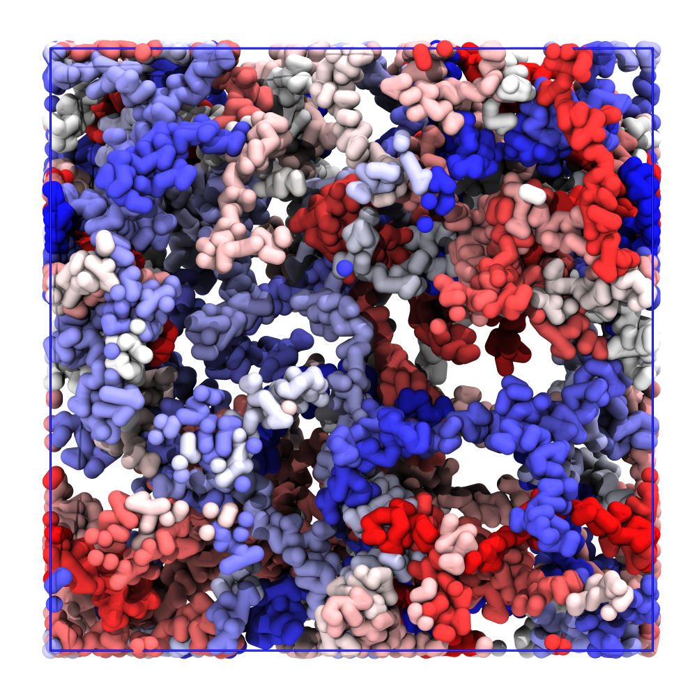
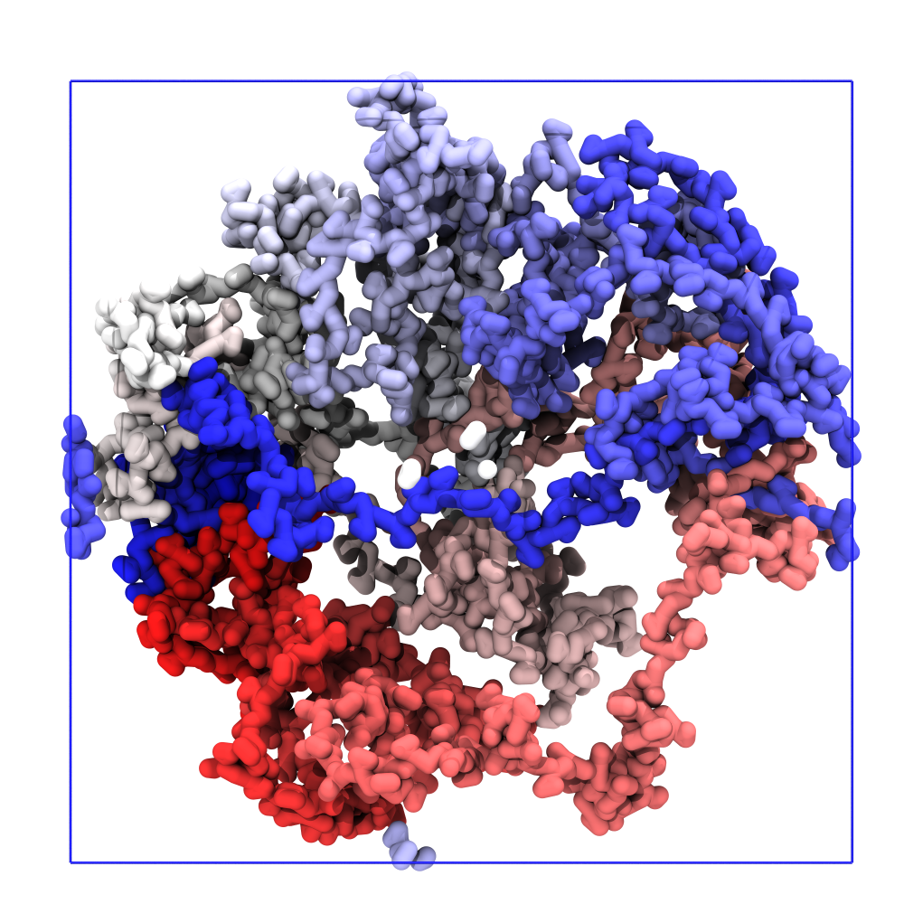

# Polymers and DNA

*This tutorial is partially based on the Polypy wiki[^ PolyplyWiki], more examples can be found there.*

In this tutorial, we will how to generate input files to perform simulations of discuss "disordered" polymers, which are present in various forms and in high abundance inside cellular environments. Examples include ssDNA, RNA, and intrinsically disordered proteins. Modeling these molecules requires specialized tools since their structure is not defined by a single conformation but rather by an ensemble of possible conformations.

In the Martini ecosystem, _Polyply_ is used to generate both the input parameter files and the starting coordinates.[^polyply] Note that _Polyply_ is a forcefield agnostic tool, which can generate input files for all sorts of polymers, ssDNA, and carbohydrates in both all-atom and coarse-grained resolution.

During the tutorial, we will focus on coarse-grained single-stranded DNA (ssDNA) simulations using the Martini2 forcefield. [^martini2] The workflow showcased can, however, be applied to other types of polymer systems.

To start this tutorial, don't forget to navigate to the respective folder in the `martini-workshop` repository:

```sh
cd 04_polymers_and_DNA
```

## Generating .itp files

First, let us generate an `itp` file for the ssDNA strand we want to study. Parameters for Martini 2 DNA are part of the _Polyply_ library. To list all available forcefields in _Polyply_, you can run:

```{execute}
polyply -list-lib
```

Thus, to generate the parameters file (`itp`) we only need the DNA sequence. Let’s start with a polyT chain of 25 residues. Simply run the command as follows:

- `-lib`:
- `-seq`:
- `-name`:
- `-seq`:
```{execute}
polyply gen_params -lib martini2 -o ssDNA.itp -name ssDNA -seq DT5:1 DT:23 DT3:1
```

For more information on the functionality of the `gen_params` subrouting, run `polyply gen_params -h`.


## Generating starting coordinates

### Polymer melt

_Polyply_ can be used to model polymer melts by randomly generating polymer coordinates using a random walk approach. The stiffness of these polymers is incorporated in the random walk using a persistence length parameter. A topology file is needed to generate a polymer melt consisting of multiple chains. In this tutorial, we will produce a melt of 100 chains of ssDNA polymer using the parameters provided created above.<br>

Create a topology file named `topol.top` and copy the following contents into it.

```text
#include "martini_v2.1-dna.itp"
#include "martini_v2.0_ions.itp"
#include "ssDNA.itp"
[ system ]
ssDNA in capsid in water
[molecules]
ssDNA 100
```

To specify the settings needed to generate the starting of our ssDNA to _Polyply_, we need to write a build_file.

```
[ molecule ]
ssDNA 0 100

[ persistence_length ]
; model lp first residue last residue
WCM 1.0 0 24
```

In the above file the molecule directive contains the molecule name as well as the molecule indices starting at 0. Because we have 100 ssDNA strands we have to specify molecules from 0 to 100. After the molecule directive, we specify the persistence_length directive: First, you provide the WCM keyword followed by the persistence length in nm. Subsequently, the first and last residue of the chain has to be specified. To generate the chain coordinates call _Polyply_ in the following fashion:

- `-p`: topology file (`.top`)
- `-b`: input file; specify molecule specific building options
- `-name`: name of the final molecul
- `-dens`: density of system (kg/m3)
- `-o`: output GRO (`.gro`)
```{execute}
polyply gen_coords -p topol.top -b build_file.bld -name ssDNA -dens 250 -o output.gro
```

For more information on the functionality of the `gen_coords` subrouting, run `polyply gen_coords -h`

Next, we have to run an energy minimization on the system.
```
mkdir -p em
gmx grompp -f mdp_files/em.mdp -p topol.top -c output.gro -o em/em.tpr
gmx mdrun -v -deffnm em/em
```
The minimized structure should look like Figure 1.

<div align="center">

</div>

*__Figure 1: Polymer melt.__  Starting structure of the polymer melt.*

## Circular polymers
Let us now also have a look at how to make circular ssDNA. The simplest way to proceed is to specify the sequence in `.ig` form that specifies a circular sequence by adding a 2 as the last character of the sequence. 
```
; Circular DNA
Random 25 bp sequence
TCCCGGCGAACTTAAAGTTGTAATG2
```
To generate the circular ssDNA `.itp` file simply run:

```{execute}
polyply gen_params -lib martini2 -o ssDNA.itp -name ssDNA -seqf sequence.ig
```
Next using the topology file from the previous example. Coordinates are generated as before; we just have to add a command line flag that tells _Polyply_ to generate it as a circle, which is done by adding the `-cycles` flag followed by the name of the molecule. To generate the starting coordinates run:

```{execute}
polyply gen_coords -p topol.top -b build_file.bld -name ssDNA -dens 250 -o output.gro -cycles ssDNA
```

Next, we have to run an energy minimization on the system.
```
mkdir -p em
gmx grompp -f mdp_files/em.mdp -p topol.top -c output.gro -o em/em.tpr
gmx mdrun -v -deffnm em/em
```
The minimized structure should look like Figure 2.

<div align="center">

</div>

<div align="center">

</div>

*__Figure 2: Melt of circular polymers.__  Starting structure of the polymer melt.*

## Confined polymers

To conclude, we will generate ssDNA enclosed inside the model cell envelope we generated in tutorial III. For convenience, we choose to generate a polyT strand of ssDNA.

```{execute}
polyply gen_params -lib martini2 -o ssDNA.itp -name ssDNA -seq DT5:1 DT:1000 DT3:1
```

We will pack a long piece of ssDNA inside a spherical confinement, mimicking the lipid vesicle. To generate the starting structure, a topology file is needed. 

Create a topology file named `topol.top` and copy the following contents into it.

```text
#include "martini_v2.1-dna.itp"
#include "martini_v2.0_ions.itp"
#include "ssDNA.itp"
[ system ]
ssDNA in capsid in water
[molecules]
ssDNA 1
```

To specify the settings needed to generate the starting of our ssDNA to _Polyply_, we need to write a build_file.

```text
[ volumes ]
DT 1

[ molecule ]
ssDNA 0 1
[ sphere ]
DT 0 1002 in 8.0 8.0 8.0 8.0

```

In the above file, the volumes directive contains the molecule name and its associated volume. Increasing the residue volume is a computationally cheap method of controlling the polymer's stiffness. After the molecule directive, we specify the `[ sphere ]` directive, giving information on the geometric constraints. We confine the ssDNA in into a sphere of radius 8, located at a central point with coordinates x=8.0, y=8.0, z=8.0.

>[!NOTE]
> In the build file, we define geometric constraints per *resname* per *molecule*.

To generate the chain coordinates call _Polyply_ in the following fashion:

```{execute}
polyply gen_coords -p topol.top -b build_file.bld -name ssDNA -box 20 20 20 -o output.gro
```

Next, we have to run an energy minimization on the system.

```
mkdir -p em
gmx grompp -f mdp_files/em.mdp -p topol.top -c output.gro -o em/em.tpr
gmx mdrun -v -deffnm em/em
```

The minimized structure should look like Figure 3.

<div align="center">

</div>

*__Figure 3: Confined polymer.__  Starting structure of the ssDNA enclosed in a spherical boundary.*

## References
[^Polyply]: Grünewald, F., Alessandri, R., Kroon, P.C. et al. Polyply; a python suite for facilitating simulations of macromolecules and nanomaterials. Nat Commun 13, 68 (2022). https://doi.org/10.1038/s41467-021-27627-4
[^Martini2]: Uusitalo, J.J., Ingólfsson, H.I., Akhshi, P., Tieleman, D.P. and Marrink, S.J., 2015. Martini coarse-grained force field: extension to DNA. Journal of chemical theory and computation, 11(8), pp.3932-3945.
[^PolyplyWiki]: https://github.com/marrink-lab/polyply_1.0/wiki
