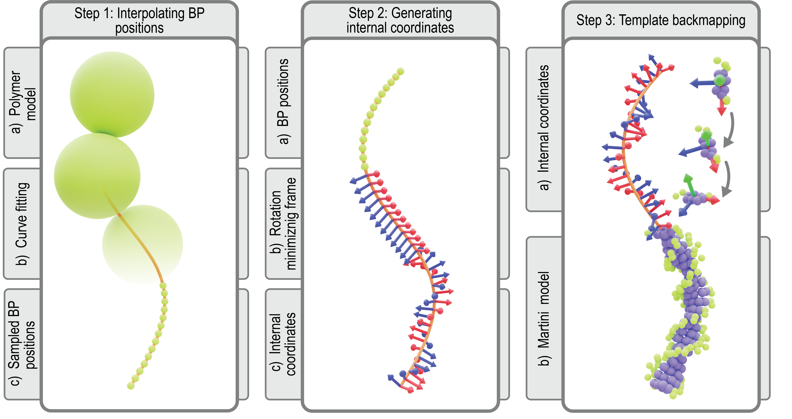
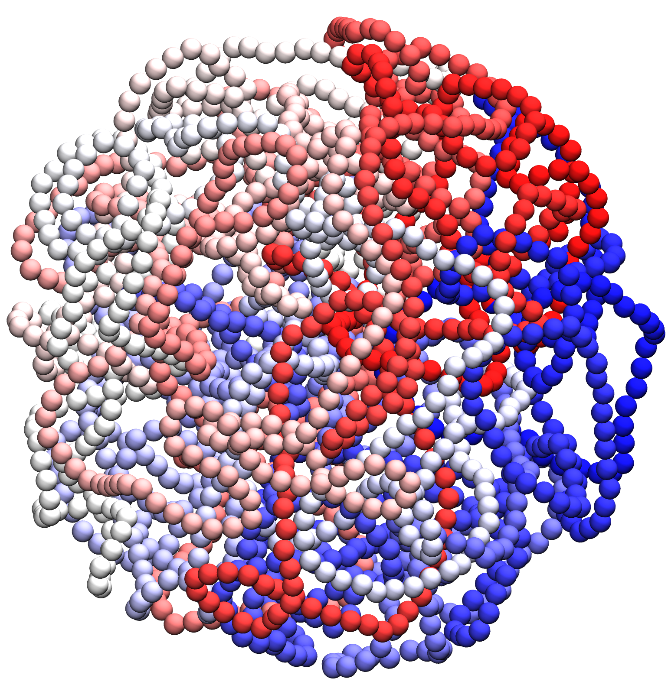
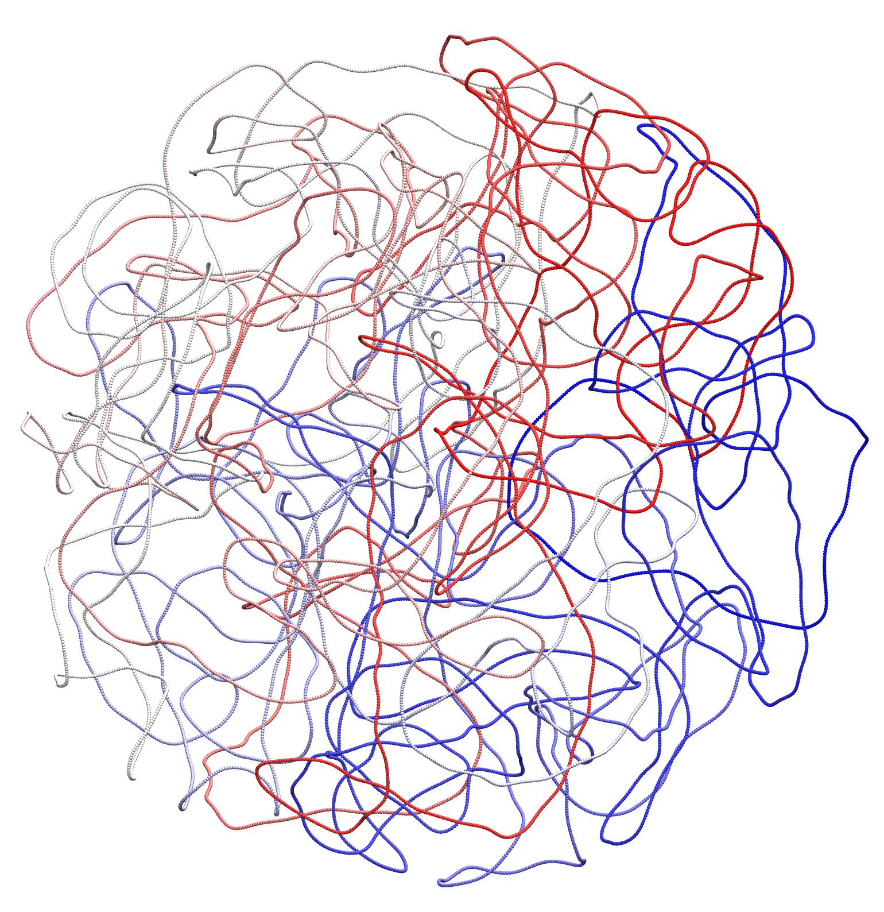
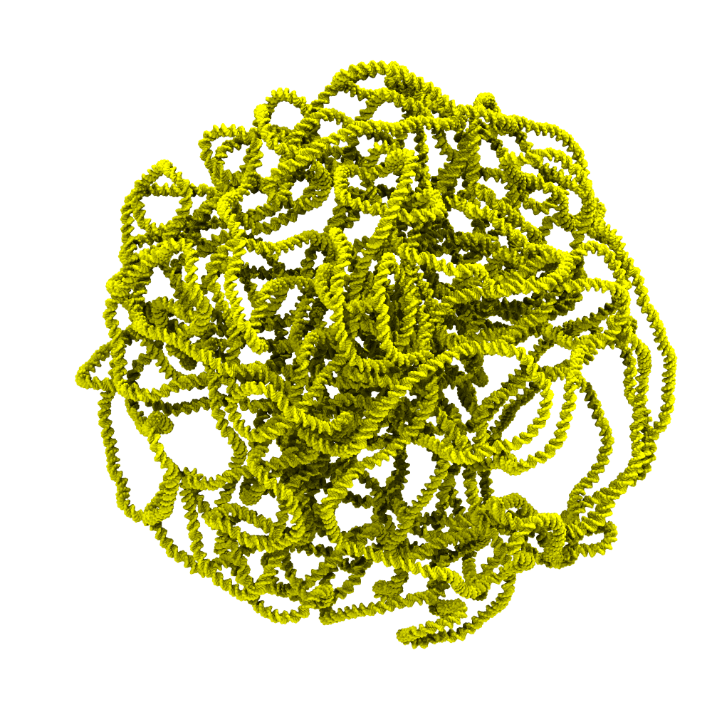
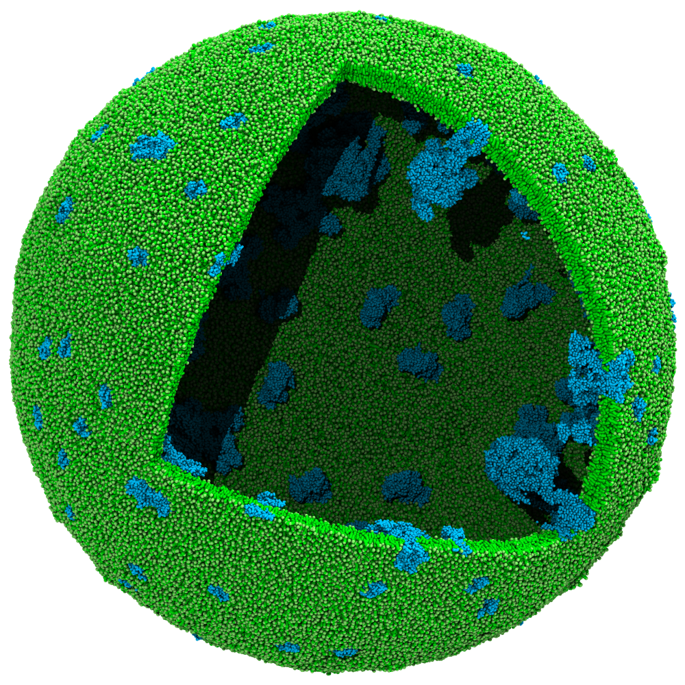
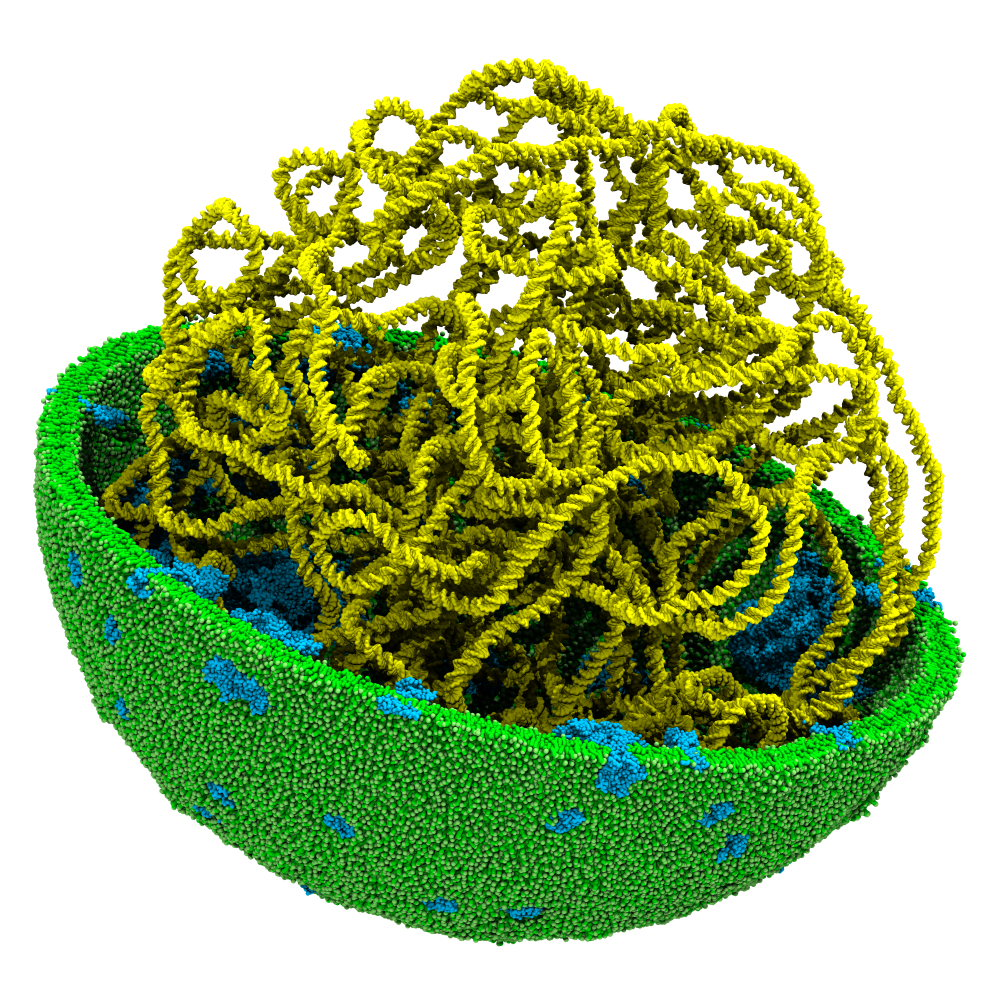
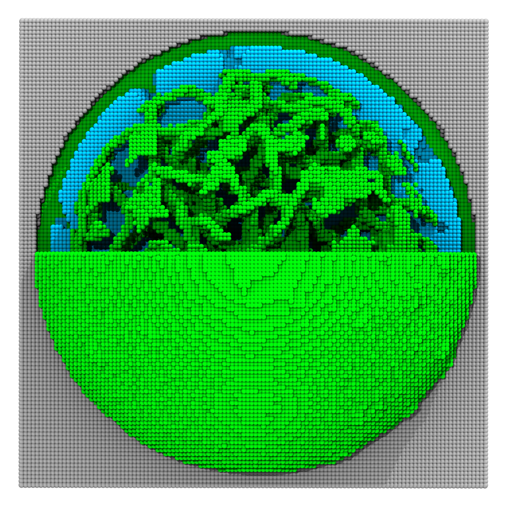
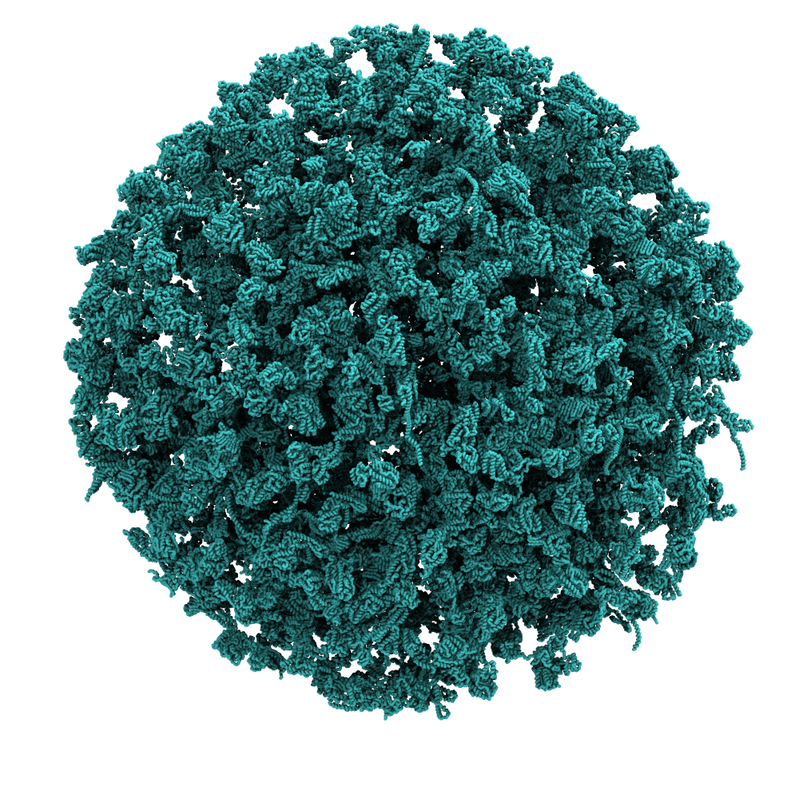

# Constructing a Martini Cell Model

After introducing the Martini ecosystem in the previous four tutorials, we will use the tools introduced to construct a cell-like model. 

To start this tutorial, don't forget to navigate to the respective folder in the `martini-workshop` repository:

```sh
cd 05_constructing_martini_cell
```

> [!TIP]
> You can download the worked examples of this tutorial [here](...). (GROMACS version 2024.1)  

### Programs

In this tutorial, we will use the following programs to build our cell model:

- `polyply` for generating the chromosome: [^polyply]
	- `pip3 install polyply==1.5.0 --user`
- `TS2CG` for creating the cell envelope: [^TS2CG]
	- 	```
		Download the latest version of the TS2CG from

		```{execute}
		git clone https://github.com/marrink-lab/TS2CG1.1
		cd TS2CG1.1
		```
		
		For compiling, gcc version 8.3.0 or above is needed.
		
		In the source code folder, execute the script `compile.sh` as
		
		```{execute}
		./comp
		```
- `bentopy` for packing our cytosol: [^bentopy]
	- `pip3 install git+https://github.com/marrink-lab/bentopy --user`
- Common command line utilities.

## Chromosome

For our cell-like model, we generated a random 20-kilobase pair sequence based on Syn3A's genome. This toymodle genome can be found in your local directory in `genome.ig`.
Using `Polyply` you can generate the corresponding topology file in Martini 2 by running the command:

```sh {execute}
polyply gen_params -lib martini2 -o chromosome.itp -name chromosome -seqf genome.ig -dsdna
```

>[!NOTE]
>Before using the generated `.itp` file in an MD simulation, two modifications are required: generating an elastic network and temporarily convert all the constraints to stiff bonds.

Now that we have the topology file, we have to generate a Martini 2 starting structure for the chromosome. The protocol for constructing coordinates for the chromosome at Martini resolution starts with interpolating the 10 bp per monomer polymer model generated as previously described (Figure 1, step 1). To this end, a periodic B-spline, m(s), is fitted to the monomer positions, {xi}, representing the chromosome’s helical axis. Along the helical axis, the bp positions, {mj}, are sampled such that each curve segment between monomer centers contains 10 bp spaced equidistantly (Figure 1, step 2). Next, we align bp template coordinates at the Martini level using the resulting bp positions (Figure 1, step 3).

<div align="center">

</div>

*__Figure 1: Martini backmapping protocol__ Schematic of the steps in the protocol used to generate coordinates in the Martini representation. By backmapping a dsDNA polymer model, the protocol efficiently creates a near-atomistic model of the entire chromosome.*

To generate the Martini 2 model of our chromosome, we give as an input the subsampled chromosome coordinates in the file `coords.dat`. To convert this to a Martini 2 model of the chromosome model, you can run:

```sh {execute}
polyply gen_coords -p topol.top -box 120 120 120 -o chromosome.gro -lib martini2 -bm_fudge 1.0 -bm_mode by-frame -mc coords.oxdna
```

> ![NOTE]
> This step may require quite some time to read the chromosome topology (it is quite large). For the tutorial's sake, we will continue using the prepared output of this command, which is provided in the current directory.

<div id="image-table">
    <table>
	    <tr>
    	    <td style="padding:10px" align="center">
                
      	    </td>
    	    <td style="padding:10px" align="center">
                
            </td>
        </tr>
        <tr></tr>
        <tr>
   	 	    <td style="padding:10px" align="center" colspan="3">
				
      	    </td>
        </tr>
    </table>
</div>

*__Figure 3: Cell chromosome__ Top left: A render of the initial structure of the mesoscale chromosome model generated by bTreeChromo. Top right: The subsampled one bead-per-base chromosome model used during backmapping. Bottom: The backmapped Martini 2 model of the cell chromosome using **Polyply**.*

To verify that the building step was successful, inspect the generated `chromosome.gro` file in VMD.

## Envelope

The next step in our cell modeling process is constructing the cell envelope. Luckily for us, the cell envelope of the Syn3A is known to be almost spherical, which makes modeling the membrane quite simple. For the membrane, we use a spherical triangulated mesh scaled to encapsulate the previously generated chromosome. The membrane composition in our model represents an experimental lipidomics composition. For simplicity, we have chosen a minimal lipid diet. The corresponding triangulated surface file (`tsi`) and membrane builder settings file (`.str`) are provided in the current directory. 

The `tsi` file also defines the vertices on which to place the membrane proteins present in the lipid membrane. In the current directory, we prepared a folder (`proteins/membrane_proteins`) containing the structure of a selection of membrane proteins present in the Syn3A. Our chosen set of membrane proteins includes ATP synthase, magnesium transporter, calcium transporter, and potassium transporter.

### Pointillism

The _TS2CG_ protocol should be somewhat familiar; as a first step, we subsample the mesh to have enough points for all the lipids. Perform the pointillism step by running:

```sh {execute}
PLM -TSfile sphere.tsi -Mashno 3 -bilayerThickness 2.0
```

### Backmap to Martini2

The next step in the _TS2CG_ protocol is performing the membrane building. Place the lipids and proteins by running:

```sh {execute}
PCG -str input.str -Bondlength 0.2 -LLIB Martini2.LIB -defout vesicle
```

<div align="center">

</div>

*__Figure 4: Cell envelope__ A render of the initial structure of the cell envelope generated by **TS2CG**.*

To verify that the building step was successful, inspect the generated `vesicle.gro` file in VMD.

## Cytosol

Now that we have a structure for the chromosome and the cell's envelope, we can bring the structures together.
Inside of the cell envelope, we want to model the cytosol.
We will place the chromosome into this compartment, and we want to fill the remaining space with protein and metabolites.
For these steps, we will use a tool that we have developed, called **bentopy**.

**bentopy** is a tool for packing molecules in spaces.
Through a spectral space reduction scheme combined with a random-placement strategy, **bentopy** can quickly set up well-stirred systems of any number of input structures.
One of its goals is to enable packing of large spaces in a user-friendly and performance-conscious manner.

Its central subcommand is **bentopy pack**, which takes an input file which specifies a space and a list of structures, and places these structures within the space.
The placements are stored in a placement list that associates the placed structures with their rotations and positions.
A space can be configured using voxel masks that define the regions where placement is allowed.
The structures are provided as a list of entries that include a name, path, and the desired number of placed instances.

The **bentopy render** subcommand creates a structure file (and topology file) from the placement list that is written by **bentopy pack**.

To create the masks that define a space, **bentopy mask** is available, which can be used to identify and select different compartments in a provided structure.
The masks are represented as compressed boolean numpy arrays (`.npz`), which provide a very flexible interface for defining these spaces.
The `mask` subcommand is a convenient interface for setting up these compressed arrays.
But since any boolean Numpy array can be saved as a valid mask, there are many other possibilities for setting these up for more specialized applications.

An additional convenient tool is provided by **bentopy grocat**.
As its name suggests, this subcommand concatenates `.gro` files.
Doing this by other means requires minimal effort, but this command provides an additional ability to replace the residue names of all particles in a provided file with some other identifier.
This new residue name is set by appending `:<name>` to the file path to apply this name to.
This can be a very useful or even necessary step for mesoscale models in distinguishing between large sets of particles and structures.

### Create a mask

First, we merge the chromosome model with the membrane model.
This allows us to define a space based on the inside of this merged model in the next step.
After the paths to the chromosome and membrane structures, we can set the residue names for each of the beads in those files with the `:<name>` notation.
For all atoms in the `chromosome.gro` structure, we set the residue names to `CHROM` and for `membrane.gro` we set them to `MEM`.
The output file is specified with the `-o`/`--output` flag.

```sh {execute}
bentopy grocat chromosome.gro:CHROM membrane.gro:MEM -o chromosome_membrane.gro
```

This merged model consists of the chromosome and the envelope around it.
With **bentopy mask**, we can select the _inside_ of this compartment.
When we use notions like inside and outside in conversation, we have a very strong sense of what that means.
Yet, defining the distinction of such compartments in a computational workflow can be tough.
The [mdvcontainment][mdvc] package provides a powerful and robust way of making this distinction, even in periodic systems.
The **mask** subcommand wraps _mdvcontainment_ to quickly create masks that serve as input for the packing process.

We are interested in the space inside our vesicle but want to exclude the chromosome.
To select this space from the merged `chromosome_membrane.gro` model.
This command operates in an interactive mode by default,[^bentopy-mask_interactive], which allows you to load and process the structure once and select compartments while it is held in memory.

To inspect the labels that are given to different regions of the space, we can give a path to the `-b`/`--inspect-labels-path` flag.
A `.gro` file in which beads are placed at the center of each voxel considered by _mdvcontainment_ will be written to that path.
Each of the beads is named according to its compartment label.
By selecting these different labels in a molecule viewer, you can find the exact space you are interested in.

However, in most cases where some inner compartment is desired from a simple system this is not required.
This also happens to be the case for us, in this example.
The `--autofill` flag instructs **mask** to automatically select all _innermost_ compartments.
To understand which spaces this flag selects, you can imagine a nested doll.
In a nested doll, the `--autofill` flag will select the space inside the innermost doll.

We write the resulting mask to `mask.npz`.
As mentioned above, this is simply a compressed boolean numpy array.
Any other means of creating such an array of the expected size would work as well---the **mask** subcommand merely serves as a convenient tool for setting these voxel masks up for most cases.

```sh {execute}
bentopy mask --inspect-labels-path labels.gro --autofill chromosome_membrane.gro mask.npz
```

In the output for this command, you may have noticed two parameters that we have not discussed yet.
For our case, the default 1.0 nm _containment resolution_ and 0.5 nm _mask resolution_ are appropriate, but they can also be overwritten.

- `--containment-resolution 1.0`: set the _containment resolution_ to some value in nm.
  This parameter sets the resolution that is used during the mdvcontainment procedure.
  If it is very low, the boundaries between compartments may not be distinguished properly, leading to fewer and unexpectedly merged compartments.
  On the other hand, if the value is too high, detail gets lost and small (parts of) compartments may not be detected.
- `--mask-resolution 0.5`: set the _mask resolution_ to some value in nm.
  When the output mask is written, its resolution and size must match those specified in the input configuration file for **bentopy pack**.

Though we used the `--autofill` flag to pick the inner compartment automatically, it can still be helpful and interesting to inspect the `labels.gro` file.
When loaded into a molecule viewer, the different label groups can be selected according to their atom name.
For instance, in VMD, the selection `name "-1"` will show the inside of the vesicle in our case, the envelope can be selected with `name "1"`, and `name "-2"` selects the outside.
Note that the quotes are necessary for correctly selecting negative-numbered labels.

[^bentopy-mask_interactive]: For automated applications, the `--no-interactive`
flag can be set to require the specification of all parameters through command
line arguments and with no input at runtime.

<div id="image-table">
    <table>
	    <tr>
    	    <td style="padding:10px" width="50%">
                
      	    </td>
    	    <td style="padding:10px" width="50%" float="center">
                
            </td>
        </tr>
    </table>
</div>

*__Figure 5: Steps of creating a packing mask__ Left panel: The structure, i.e. the chromosome and
eveleope, in which we want to pack our cytosol. Right panel: Visualisation of the mask generated by `bentopy mask`.
The image shows three distinct regions, the occupied space in our system (green), the empty space
**inside** of the structure (blue) and the empty space **outside** the structure (grey).*

### Pack the cell

With this mask ready, we can already move on to packing that space with protein and metabolites.
In order to specify what objects we want place in which space, we need to create an input file.

Let's learn how `cytosol_input.json` is set up.

#### The _space_ section

To define the space in which the placement procedure will take place, we must set the following fields:

- _size_: a three-integer list describing the dimensions of the space in nm, (_x_, _y_, _z_) order.
  Note that this _size_ must match the nm dimensions of the mask we just set up.
- _resolution_: the size of the voxels in nm that are used to represent the space internally.
  Note that the _resolution_ must match the _mask resolution_ that was used in setting up the mask.
- _compartments_: a list of compartments. A compartment has the following structure:
    - _id_: a name for the compartment.
    - One of the following two options:
        - _voxels_: provide the _path_ to a voxel mask (any compressed boolean numpy array, `.npz`).
        - _shape_: use an analytical function to set up the internal voxel mask.
          Takes the name of a shape from the following options: "spherical", "cuboid", "none".
          (Note that this option is very likely to change.)

```json
{
	"space": {
		"size": [120, 120, 120],
		"resolution": 0.5,
		"compartments": [
			{
				"id": "cytosol",
				"voxels": {
					"path": "mask.npz"
				}
			}
		]
	},
```

#### The _output_ section

In the _output_ section, we can specify what information should be associated with the placement and where the output should be written to.
As is explained in detail later, the output of **bentopy pack** is not the final structure.
Instead, an intermediate instance-based list of placements is written out a file we call the _placement list_.
The _output_ section takes the following information:

- _title_: the name of this placement. This will become the title of the placement list.
- _dir_: the directory to which the output files are placed.
- _topol_includes_: a list of files that will be included in the topology (`.top`) file rendered from the placement list.

```json
	"output": {
		"title": "workshop_cell",
		"dir": "outputs",
		"topol_includes": [
			"martini_v2.1-dna.itp",
			"martini_v2.0_ions.itp",
			"chromosome.itp",
			"metabolites.itp",
			"cytosolic_proteins.itp",
			"membrane_proteins.itp",
			"lipids.itp"
		]
	},
```

#### The _segments_ section

All structures we want to place must be listed in the _segments_ section.
Each segment definition has the following fields:

- _name_: a name for the structure corresponding to its definition in the `.itp` files defined above in the _output.topol_includes_ field.
  Since this _name_ will be used to write the top file, it is important to set it up correctly here.
- _path_: the path to the relevant structure file (`.pdb` or `.gro`).
- _number_: an integer value that represents the number of desired placements for this structure.
- _compartments_: a list of the compartments where this structure may be placed. In our case, this is the `"cytosol"` compartment for all of these structures.

It is common to place this section last since it tends to be long.

```json
	"segments": [
		{
			"name": "syn539",
			"path": "structures/proteins/syn539_cg.pdb",
			"number": 50,
			"compartments": [ "cytosol" ]
		},
        // More cg protein structures...
		{
			"name": "syn6",
			"path": "structures/proteins/syn6_cg.pdb",
			"number": 50,
			"compartments": [ "cytosol" ]
		}
	]
}
```

<details>
<summary>The full `cytosol_input.json` file.</summary>

```json
{
	"space": {
		"size": [120, 120, 120],
		"resolution": 0.5,
		"compartments": [ { "id": "cytosol",
				"voxels": {
					"path": "mask.npz"
				}
			}
		]
	},
	"output": {
		"title": "workshop_cell",
		"dir": "outputs",
		"topol_includes": [
			"martini_v2.1-dna.itp",
			"martini_v2.0_ions.itp",
			"chromosome.itp",
			"metabolites.itp",
			"cytosolic_proteins.itp",
			"membrane_proteins.itp",
			"lipids.itp"
		]
	},
	"segments": [
		{
			"name": "syn539",
			"path": "structures/proteins/syn539_cg.pdb",
			"number": 50,
			"compartments": [ "cytosol" ]
		},
		{
			"name": "syn804",
			"path": "structures/proteins/syn804_cg.pdb",
			"number": 50,
			"compartments": [ "cytosol" ]
		},
		{
			"name": "syn637",
			"path": "structures/proteins/syn637_cg.pdb",
			"number": 50,
			"compartments": [ "cytosol" ]
		},
		{
			"name": "syn163",
			"path": "structures/proteins/syn163_cg.pdb",
			"number": 50,
			"compartments": [ "cytosol" ]
		},
		{
			"name": "syn451",
			"path": "structures/proteins/syn451_cg.pdb",
			"number": 50,
			"compartments": [ "cytosol" ]
		},
		{
			"name": "syn305",
			"path": "structures/proteins/syn305_cg.pdb",
			"number": 50,
			"compartments": [ "cytosol" ]
		},
		{
			"name": "syn353",
			"path": "structures/proteins/syn353_cg.pdb",
			"number": 50,
			"compartments": [ "cytosol" ]
		},
		{
			"name": "syn220",
			"path": "structures/proteins/syn220_cg.pdb",
			"number": 50,
			"compartments": [ "cytosol" ]
		},
		{
			"name": "syn407",
			"path": "structures/proteins/syn407_cg.pdb",
			"number": 50,
			"compartments": [ "cytosol" ]
		},
		{
			"name": "syn809",
			"path": "structures/proteins/syn809_cg.pdb",
			"number": 50,
			"compartments": [ "cytosol" ]
		},
		{
			"name": "syn447",
			"path": "structures/proteins/syn447_cg.pdb",
			"number": 50,
			"compartments": [ "cytosol" ]
		},
		{
			"name": "syn260",
			"path": "structures/proteins/syn260_cg.pdb",
			"number": 50,
			"compartments": [ "cytosol" ]
		},
		{
			"name": "syn308",
			"path": "structures/proteins/syn308_cg.pdb",
			"number": 50,
			"compartments": [ "cytosol" ]
		},
		{
			"name": "syn95",
			"path": "structures/proteins/syn95_cg.pdb",
			"number": 50,
			"compartments": [ "cytosol" ]
		},
		{
			"name": "syn661",
			"path": "structures/proteins/syn661_cg.pdb",
			"number": 50,
			"compartments": [ "cytosol" ]
		},
		{
			"name": "syn348",
			"path": "structures/proteins/syn348_cg.pdb",
			"number": 50,
			"compartments": [ "cytosol" ]
		},
		{
			"name": "syn79",
			"path": "structures/proteins/syn79_cg.pdb",
			"number": 50,
			"compartments": [ "cytosol" ]
		},
		{
			"name": "syn142",
			"path": "structures/proteins/syn142_cg.pdb",
			"number": 50,
			"compartments": [ "cytosol" ]
		},
		{
			"name": "syn297",
			"path": "structures/proteins/syn297_cg.pdb",
			"number": 50,
			"compartments": [ "cytosol" ]
		},
		{
			"name": "syn6",
			"path": "structures/proteins/syn6_cg.pdb",
			"number": 50,
			"compartments": [ "cytosol" ]
		}
	]
}
```

</details>

#### Packing

Now that we have our input file, we can move on to actually packing the cell.
We provide the following command line options:

- `--rearrange`: order the specified segments according to the voxel volume they occupy, placing the largest structures first and the smallest structures last.
  This rearrangement is a heuristic to improve the quality of the packing.
  When a number of small structures are placed first, large structures may be hard to place even when enough voxel volume is available.
  If this flag is not set, the user-provided order from the input file is respected.
- `--seed 5172`: set the random number generator seed.
  Since **bentopy pack** places according to a random sampling scheme, we must set a seed to make the placements deterministic.
- `--rotations 3`: the number of random rotations to sample for each listed segment.
  For instance, if the desired placement number for some segment is set to 30, and the number of rotations is set to 3, ten placements will be made for each of the three random rotations (unless the space is full and placement is obstructed).

```sh {execute}
bentopy pack --rearrange --seed 5172 --rotations 3 cytosol_input.json
```

As we specified in the _output_ section of the input configuration, the placements that are determined during the packing procedure will be written to the `outputs` directory as an instance-based list.
In this list, each structure is matched with each rotations and all its associated translations (structure center positions).

<details>
<summary>
Writing the placements to such an intermediate file format has several advantages.
</summary>

- No time is spent waiting for costly formatting and disk writes during packing.
- Representing the placement of a larger structure as a simple translation and rotation minimizes memory overhead. Storing all particles for the placed structures can take up considerable memory at large scales.
The lightweight placement list file is trivial to transfer, while a rendered structure file may be very large and slow to send around.
- Inspecting a full structure file can be slow or even prohibitive. Rendering only a part of the beads involved or even only one bead per structure instance based on the placement list can be very helpful in such cases. (See the command's usage information about the `--mode` option.)
- The final structure can be rendered very quickly. **bentopy render**, which renders the placement list to a structure file is a stand-alone, optimized executable written in a very fast language.
</details>

### Render the cell to `.gro`

Convert the placements list to a `.gro` file

With the `-t`/`--topology` flag, we specify a path to write a topology file to, based on the placement list.
As you may recall, the _name_ field for each segment entry will be used as the identifier for each structure in the topology file.
We render the structure to `cytosol.gro`.

```sh {execute}
bentopy render -t topol.top outputs/workshop_cell_placements.json cytosol.gro
```

## Assemble Cell

We will use **bentopy grocat** a final time to combine our cytosol with the chromosome-membrane structure we created earlier.
Since the `chromosome_membrane.gro` structure was already labeled with the `CHROM` and `MEM` labels, we will not set a residue name for that structure.
To properly distinguish the atoms from `cytosol.gro` in the final structure, we label them with the `CYT` residue name.
The final structure is written to `cell.gro`.

```sh {execute}
bentopy grocat chromosome_membrane.gro cytosol.gro:CYT -o cell.gro
```

<div id="image-table">
    <table>
	    <tr>
    	    <td style="padding:10px" width="50%">
                
      	    </td>
    	    <td style="padding:10px" width="50%" float="center">
                
            </td>
        </tr>
    </table>
</div>

*__Figure 6: Steps of packig the cell__ Left panel: A render of only the cytosolic proteins that
have been packed inside of the predifined mask. Right panel: The final cell structure after
concatonating togheter the chromosome, envelope and cytosol.*

## References

[^mdvc]: https://github.com/BartBruininks/mdvcontainment
[^TS2CG]: Pezeshkian, W., König, M., Wassenaar, T.A. et al. Backmapping triangulated surfaces to coarse-grained membrane models. Nat Commun 11, 2296 (2020). https://doi.org/10.1038/s41467-020-16094-y
[^polyply]: Grünewald, F., Alessandri, R., Kroon, P.C. et al. Polyply; a python suite for facilitating simulations of macromolecules and nanomaterials. Nat Commun 13, 68 (2022). https://doi.org/10.1038/s41467-021-27627-4
[^bentopy]: https://github.com/marrink-lab/bentopy


