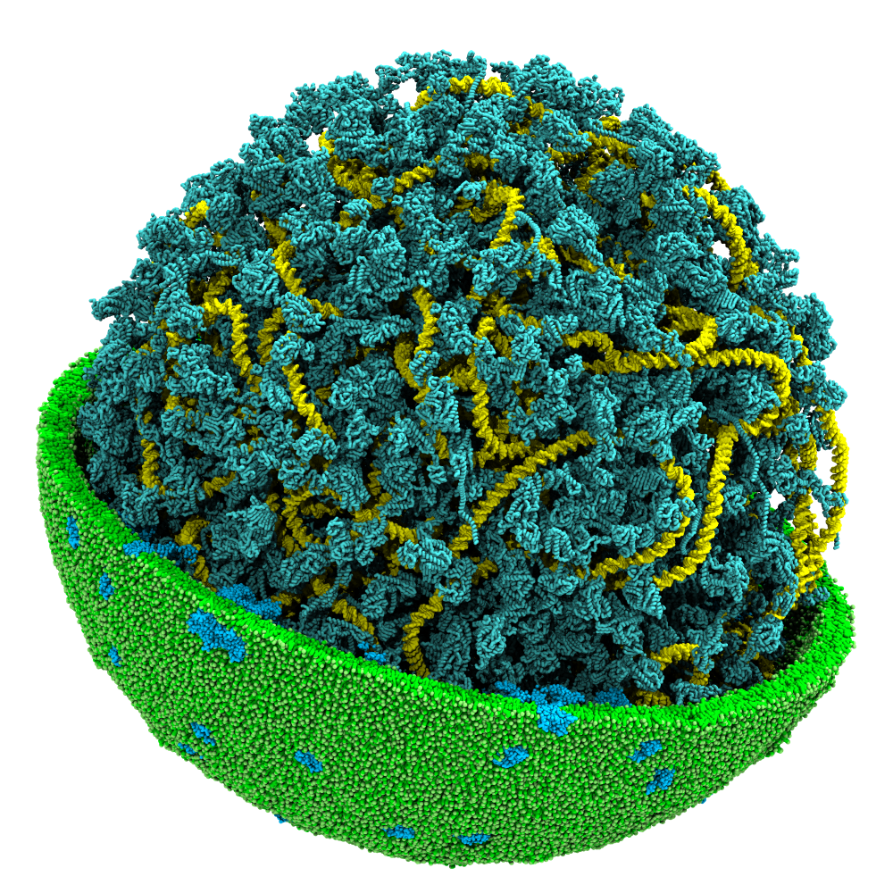

# Martini Workshop: Simulating a Minimal Bacterial Cell



These tutorial exercises aim to demonstrate how the Martini forcefield and associated software ecosystem can be used to study biological systems and ultimately simulate whole-cell models. The purpose is to introduce you to the basic and some more advanced aspects of using GROMACS to perform Martini coarse-grained simulations.<br>
These tutorials assume prior knowledge of basic concepts in molecular dynamics and familiarity with GROMACS. For an explanation of how to work with GROMACS and the specification of force field and run parameters, please refer to the GROMACS [user guid](https://manual.gromacs.org/current/user-guide/index.html) and [web pages](www.gromacs.org). In addition, excellent GROMACS tutorials are available [here](https://tutorials.gromacs.org/).

This tutorial series follows a logical path, where each tutorial introduces a new element of the Martini ecosystem, ultimately combining these different elements into a model of a bacterial cell. 
<br>
<div align="center">

### Tutorials

[Tutorial I: Bilayer Self-assembly](01_bilayer_self_assembly/tutorial.md)
	
[Tutorial II: Protein Basics](02_protein_basics/tutorial.md)
	
[Tutorial III: Membranes and Vesicles](03_membranes_and_vesicles/tutorial.md)
	
[Tutorial IV: Polymers and DNA](04_polymers_and_DNA/tutorial.md)
	
[Tutorial V: Constructing Martini cell model](05_constructing_martini_cell/tutorial.md)	
	
</div>

<br>

We start, historically accurate, by introducing the Martini model for lipids, followed by a simulation of a small protein. In Tutorial III, these two models will be combined to generate a lipid vesicle containing membrane proteins. In Tutorial IV, we will use Polyply to fill the vesicle that we previously generated with a long fragment of single-stranded Martini2 DNA. To conclude, we will then move on to Tutorial V, where we will merge all of these different elements together to create a toy model of a bacterial cell.

To begin the tutorial, clone the `martini-workshop` repository using the command:

```
git clone https://github.com/marrink-lab/martini-workshop.git
cd martini-workshop
```

Afterwards, complete the tutorials in their respective folders.


> [!TIP] 
> If one of the simulations takes too long, you can download a worked example for each tutorial [here](https://github.com/marrink-lab/martini-workshop/...).

These tutorials were written originally for the *"Workshop: Simulations and Visualization of a Minimal Bacterial Cell"* in Champaign-Urbana by *Jan Stevens, Marieke Westendorp, Mert Bozoflu, Bart Bruininks, Siewert-Jan Marrink*. Parts of this workshop were based on the [*2021 Martini online workshop*](http://cgmartini.nl/index.php/2021-martini-online-workshop).

