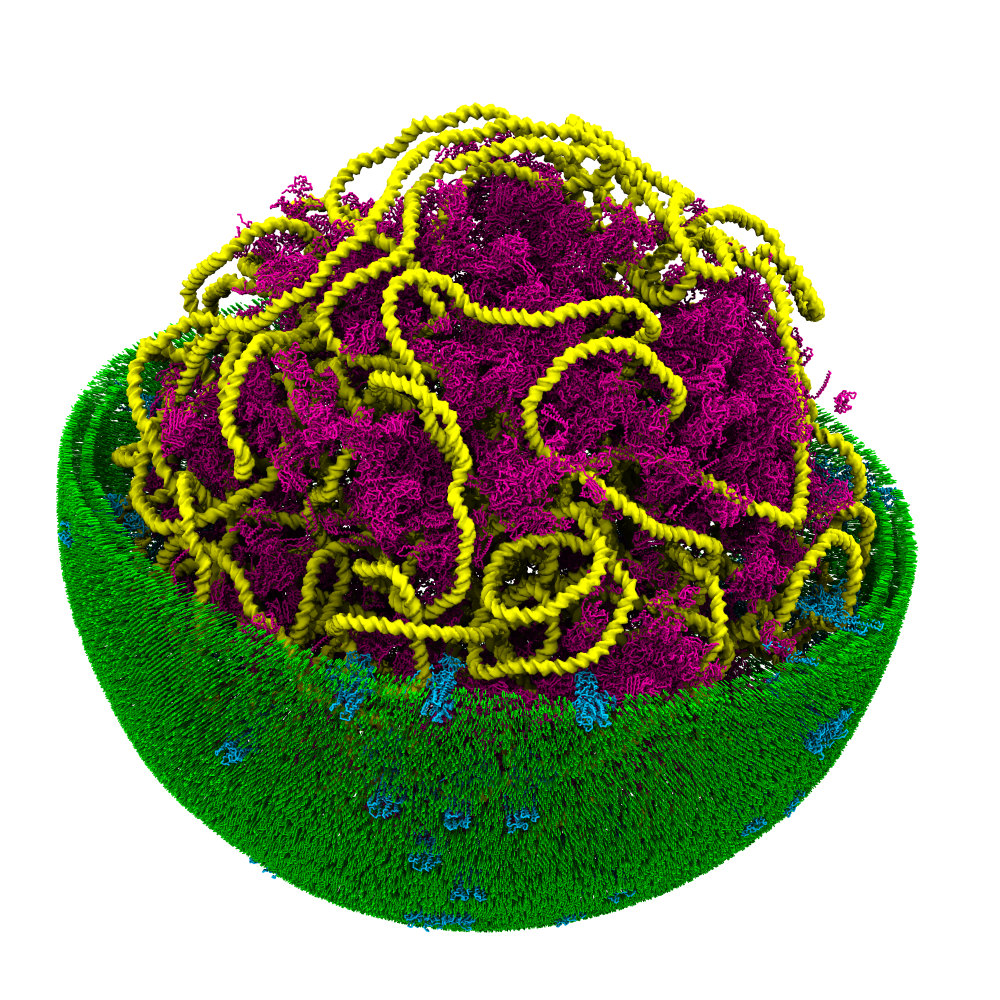

# martini-workshop
Martini tutorials for "Minimal Cell" workshop

    

[Tutorial I: Bilayer Self-assembly](01_bilayer_self_assembly/tutorial.md) 
[Tutorial II: Proteins Basic](02_proteins_basic/tutorial.md) 
[Tutorial III: Membranes and Vesicles](03_membranes_and_vesicles/tutorial.md) 
[Tutorial IV: Polymers and DNA](04_polymers_and_DNA/tutorial.md) 
[Tutorial V: Constructing Martini cell model](05_constructing_martini_cell/tutorial.md) 
[Tutorial VI: Simulate Martini cell model](06_simulate_martini_cell_model/tutorial.md)
